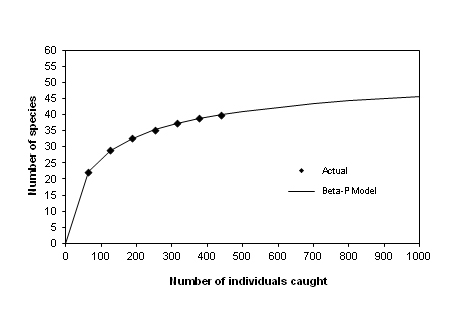

```{r, echo=FALSE}
htmltools::img(src = knitr::image_uri("./data/SanJose/logo.png"), 
               alt = 'logo', 
               style = 'position:absolute; top:0; right:0; padding:10px;')
```

```{r Libraries, warning=FALSE, message=FALSE, echo = FALSE,  eval = TRUE}

# library(shiny)
library(plotly)
library(leaflet)
library(plyr)
library(dplyr)
library(ggplot2)
library(rgdal)
library(tidyverse)
library(sf)
library(rgeos)
library(httr)
library(jsonlite)
library(raster)
library(data.table)
library(leaflet.providers)
library(knitr)
library(kableExtra)
library(reactable)
library(readxl)
library(downloadthis)
library(leaflet.multiopacity)
library(leaflet.extras)
library(DT)

col_BoldRiverBlue = "#242456"
col_BoldSunYellow = "#FFD450"
col_BoldGrassGreen = "#2A553E"
col_BoldEarthGrey = "#7B7A66"
col_BoldBrickOrange = "#F26640"
col_LightRiverBlue = "#E3E6FF"
col_LightSunYellow = "#FFEDBA"
col_LightGrassGreen = "#C4F4D5"
col_LightEarthGrey = "#ECE2D6"
col_LightBrickOrange = "#FED3CF"
col_White = "#FFFFFF"
col_Black = "#000000"


color_score_red_0 = "#145A32"
color_score_orange_1 = "#2ECC71"
color_score_yellow_2 = "#F4D03F"
color_score_green_3 = "#E67E22"
color_score_green_4 = "#C0392B"

```


# Overview{#overview}

This report provides data and indicators to support city-level decision-making on protecting and improving biodiversity. It is part of the [UrbanShift](https://shiftcities.org) project, and similar reports for all UrbanShift cities will be available onthe UrbanShift website and the data used in them available on the UrbanShift [Data Hub](https://urbanshift-data-hub-worldresources.hub.arcgis.com/). As described in the geospatial analysis framework for UrbanShift [link], baseline indicator reports are also being completed for these cities on the themes of greenhouse gas emissions and land degradation.

This report includes biodiversity indicators for the metropolitan area of San José, Costa Rica, including 31 municipalities within.

# Biodiversity indicators{#biodiversity-indicators}

Most of the indicators below are described in the [Singapore Index on Cities’ Biodiversity](#singapore-index) and can be used for assessment of current efforts and to identify areas of action to prioritize in future efforts. The data are drawn from [public, global datasets](#data-sources) published by reputable organizations. In many cases, cities will have access to local data that are of higher quality or are more specifically suited to local contexts and needs than what we can provide from global data.

```{r biodiversity_indicators_outputs, eval=TRUE, echo=FALSE, message=FALSE, warning=FALSE}
biodiversity_baseline_indicators <- read_excel("./data/SanJose/biodiversity_baseline_newmunis.xlsx", 
                                               sheet = "MAIN")
biodiversity_baseline_indicators <- read_excel("./data/SanJose/biodiversity_baseline_newmunis.xlsx", 
                                               sheet = "MAIN-v2")

biodiversity_baseline_indicators_11 <- read.csv("./data/SanJose/biodiversity_baseline_newmunis_SICB_11.csv")

boundary_municipality = st_read("./data/SanJose/sj_newbounds.geojson",
                     quiet = TRUE)

# join with geo
biodiversity_baseline_indicators_geo = boundary_municipality %>% 
  left_join(biodiversity_baseline_indicators,
            by = c("shapeName" = "Municipality name"))


```

```{r city-boundary,  eval = TRUE, warning=FALSE, message=FALSE, echo = FALSE}
# read all boundaries
urbanshift_boundaries = st_read("https://cities-urbanshift.s3.eu-west-3.amazonaws.com/data/boundaries/administrative_boundaries.geojson",
                                quiet = TRUE)


# change San jose boundary status
urbanshift_boundaries[urbanshift_boundaries$city_name == "CRI-San_Jose" & urbanshift_boundaries$boundary_data_source == "cities360", "boundary_use"] = TRUE
urbanshift_boundaries[urbanshift_boundaries$city_name == "CRI-San_Jose" & urbanshift_boundaries$boundary_data_source == "city_specific", "boundary_use"] = FALSE

# # select verified boundaries
urbanshift_boundaries = urbanshift_boundaries[urbanshift_boundaries$boundary_use == TRUE, ]

# specify the cityid
city_id = "CRI-San_Jose"

# extract city boundary
city_boundary = urbanshift_boundaries[urbanshift_boundaries$city_name == city_id, ]

# set view param
city_boundary_centroid <- st_centroid(city_boundary)
city_boundary_centroid_coords = st_coordinates(city_boundary_centroid)
city_boundary_centroid_lng = city_boundary_centroid_coords[,"X"]
city_boundary_centroid_lat = city_boundary_centroid_coords[,"Y"]

# boundaries GAM

GAM_boundaries = st_read("./data/SanJose/boundaries_GAM/LimiteCantonal_GAM.shp",
                         quiet = TRUE)
```

```{r biodiversity_indicators_outputs_metropolitan, eval=TRUE, echo=FALSE, message=FALSE, warning=FALSE}
# biodiversity_indicators_outputs-metropolitan ----

biodiversity_baseline_indicators_metro <- read_excel("./data/SanJose/biodiversity_baseline_newmunis_metropolitan.xlsx", 
                                               sheet = "MAIN")

biodiversity_metro = biodiversity_baseline_indicators_metro %>% 
  slice(2L) %>% 
  dplyr::select(`SICB-1`,`SICB-2`,`SICB-3`,
                `SICB-7A`, `SICB-7B`, 
                `SICB-8`, `SICB-10`, `SICB-12`, `SICB-13`,
                `KBA(protected)`, `KBA(built-up)`)%>% 
  mutate(`SICB-1` = as.numeric(`SICB-1`)) %>% 
  mutate(`SICB-2` = as.numeric(`SICB-2`)) %>% 
  mutate(`SICB-3` = as.numeric(`SICB-3`)) %>% 
  mutate(`SICB-7A` = as.numeric(`SICB-7A`)) %>% 
  mutate(`SICB-7B` = as.numeric(`SICB-7B`)) %>% 
  mutate(`SICB-8` = as.numeric(`SICB-8`)) %>% 
  mutate(`SICB-10` = as.numeric(`SICB-10`)) %>% 
  mutate(`SICB-12` = as.numeric(`SICB-12`)) %>%
  mutate(`SICB-13` = as.numeric(`SICB-13`)) %>%
  mutate(`KBA-protected` = as.numeric(`KBA(protected)`)) %>%
  mutate(`KBA-built-up` = as.numeric(`KBA(built-up)`)) %>%
  # SICB-1
  mutate(`SICB-1-value` = round(`SICB-1`,4)*100) %>% 
  mutate(`SICB-1-score`=
           case_when(`SICB-1-value` < 1 ~ "0",
                     `SICB-1-value` <7 ~ "1",
                     `SICB-1-value` <14 ~ "2",
                     `SICB-1-value` <20 ~ "3",
                     `SICB-1-value` >= 20 ~ "4")) %>% 
  # SICB-2
  mutate(`SICB-2-value` = round(`SICB-2`,4)*100) %>% 
  mutate(`SICB-2-score`=
           case_when(`SICB-2-value` < 20 ~ "0",
                     `SICB-2-value` <39.9 ~ "1",
                     `SICB-2-value` <59.9 ~ "2",
                     `SICB-2-value` <79 ~ "3",
                     `SICB-2-value` >= 79 ~ "4")) %>% 
  # SICB-3
  mutate(`SICB-3-value` = round(`SICB-3`,4)*100) %>% 
  mutate(`SICB-3-score`=
           case_when(`SICB-3-value` < 6 ~ "0",
                     `SICB-3-value` <11 ~ "1",
                     `SICB-3-value` <16 ~ "2",
                     `SICB-3-value` <20 ~ "3",
                     `SICB-3-value` >= 20 ~ "4")) %>% 
  # SICB-7A
  mutate(`SICB-7A-value` = round(`SICB-7A`,4)*100) %>% 
  mutate(`SICB-7A-score`=
           case_when(`SICB-7A-value` < 20 ~ "0",
                     `SICB-7A-value` <  40 ~ "1",
                     `SICB-7A-value` < 60 ~ "2",
                     `SICB-7A-value` < 80 ~ "3",
                     `SICB-7A-value` >= 80 ~ "4")) %>% 
  # SICB-7B
  mutate(`SICB-7B-value` = round(`SICB-7B`,4)*100) %>% 
  mutate(`SICB-7B-score`=
           case_when(`SICB-7B-value` < 20 ~ "0",
                     `SICB-7B-value` <  40 ~ "1",
                     `SICB-7B-value` < 60 ~ "2",
                     `SICB-7B-value` < 80 ~ "3",
                     `SICB-7B-value` >= 80 ~ "4")) %>% 
  # SICB-8
  mutate(`SICB-8-value` = round(`SICB-8`,4)*100) %>% 
  mutate(`SICB-8-score`=
           case_when(`SICB-8-value` < 1 ~ "0",
                     `SICB-8-value` <  6 ~ "1",
                     `SICB-8-value` < 11 ~ "2",
                     `SICB-8-value` < 17 ~ "3",
                     `SICB-8-value` >= 17 ~ "4")) %>% 
  # SICB-10
  mutate(`SICB-10-value` = round(`SICB-10`,4)*100) %>% 
  mutate(`SICB-10-score`=
           case_when(`SICB-10-value` < 30 ~ "0",
                     `SICB-10-value` <  40 ~ "1",
                     `SICB-10-value` < 50 ~ "2",
                     `SICB-10-value` < 60 ~ "3",
                     `SICB-10-value` >= 60 ~ "4")) %>% 
  # SICB-12
  mutate(`SICB-12-value` = round(`SICB-12`,4)) %>%
  mutate(`SICB-12-score`=
           case_when(`SICB-12-value` < 0.1 ~ "0",
                     `SICB-12-value` <  0.3 ~ "1",
                     `SICB-12-value` < 0.6 ~ "2",
                     `SICB-12-value` < 0.9 ~ "3",
                     `SICB-12-value` >= 0.9 ~ "4")) %>% 
  # SICB-13
  mutate(`SICB-13-value` = round(`SICB-13`,4)*100) %>% 
  mutate(`SICB-13-score`=
           case_when(`SICB-13-value` < 30 ~ "0",
                     `SICB-13-value` <  49.9 ~ "1",
                     `SICB-13-value` < 69.9 ~ "2",
                     `SICB-13-value` < 89.9 ~ "3",
                     `SICB-13-value` >= 90 ~ "4")) %>% 
  # KBA 
  mutate(`KBA-protected-value` = round(`KBA-protected`,4)*100) %>% 
  mutate(`KBA-protected-built-up` = round(`KBA-built-up`,4)*100) %>% 
  mutate(`Region` = "San Jose metropolitan area")
```


## Proportion of Natural Areas (SICB-1){#SICB-1}

Natural areas support biodiversity by providing habitat. They also provide human beings with ecosystem services. The portion of the total city area that is close to a natural state thus provides information both about a city’s biodiversity and about the benefits provided by biodiversity.

Natural ecosystems are defined as all areas that are natural and not highly disturbed or completely human-altered landscapes. Examples of natural ecosystems include forests, mangroves, freshwater swamps, natural grasslands, streams, lakes, etc. Parks, golf courses, cropland, and roadside plantings are not considered natural.

This indicator is calculated as the percent of natural area within the city boundary: *(Total area of natural, restored and naturalized areas) ÷ (Area of city) × 100%*

We calculated this indicator using the ESA WorldCover 10 m 2020 V100 land-classification map. We included as natural area all land classified as trees, shrubland, grassland, herbaceous wetland, mangrove, or moss and lichen.


```{r SCIB-1-table, eval=TRUE, echo=FALSE, message=FALSE, warning=FALSE}
biodiversity_baseline_indicators_geo = biodiversity_baseline_indicators_geo %>% 
  mutate(`SICB-1-value` = round(`SICB-1`,4)*100) %>% 
  mutate(`SICB-1-score`=
           case_when(`SICB-1-value` < 1 ~ "0",
                     `SICB-1-value` <7 ~ "1",
                     `SICB-1-value` <14 ~ "2",
                     `SICB-1-value` <20 ~ "3",
                     `SICB-1-value` >= 20 ~ "4"))

SCIB_1_table = biodiversity_baseline_indicators_geo %>% 
  as.data.frame() %>% 
  dplyr::select("Municipality"= "shapeName",
                "SICB-1-value",
                "SICB-1-score")


```

```{r SCIB-1-table-region, eval=TRUE, echo=FALSE, message=FALSE, warning=FALSE}
# SCIB-1-table-Region ----

biodiversity_metro %>% 
  dplyr::select(`Region`,
                `SICB-1-value`,
                `SICB-1-score`) %>% 
  mutate_at(vars(`SICB-1-score`), ~ cell_spec(
    ., "html", 
    bold = TRUE,
    color = "white",
    background = ifelse(. == "4", "#145A32", ifelse(. ==  "3", "#2ECC71", ifelse(. == "2", "#F4D03F", ifelse(. == "2", "#E67E22", "#C0392B"))))
  )) %>% 
  kable(format = "html", escape = FALSE) %>%
  kable_styling("striped", full_width = FALSE) %>% 
  scroll_box(width = "100%", height = "100px")

```

```{r esa-data, eval=TRUE, echo=FALSE, message=FALSE, warning=FALSE}
# worldcoverc_data_path = paste("https://cities-urbanshift.s3.eu-west-3.amazonaws.com/data/land_use/esa_world_cover/world_cover_10m_",
#                               city_id,
#                               ".tif",
#                               sep = "")
# city_worldcover_raster = raster(worldcoverc_data_path)
# city_worldcover  = raster::mask(city_worldcover_raster,
#                                 city_boundary)

worldcoverc_data_path_v2 = "https://cities-urbanshift.s3.eu-west-3.amazonaws.com/baseline-indicators/biodiversity/data/CRI-San_Jose/CRI-San_Jose-ESA-landcover-2020.tif"
city_worldcover_raster = raster(worldcoverc_data_path_v2)
city_worldcover  = raster::mask(city_worldcover_raster,
                                city_boundary)

# define color palette for WOrld cover
Trees_10_green = "#006400"
Shrubland_20_orange = "#ffbb22"
Grassland_30_yellow = "#ffff4c" 
Cropland_40_mauve = "#f096ff"
Built_up_50_red = "#fa0000"
Barren_sparse_vegetation_60_gray = "#b4b4b4"
Snow_ice_70_white = "#f0f0f0"
Open_Water_80_blue = "#0064c8"
Herbaceous_wetland_90_blue2 = "#0096a0"
Mangroves_95_green2 = "#00cf75"
Moss_lichen_100_beige = "#fae6a0"

worldcover_col = c(Trees_10_green,
                   Shrubland_20_orange,
                   Grassland_30_yellow,
                   Cropland_40_mauve,
                   Built_up_50_red,
                   Barren_sparse_vegetation_60_gray,
                   Snow_ice_70_white,
                   Open_Water_80_blue,
                   Herbaceous_wetland_90_blue2,
                   Mangroves_95_green2,
                   Moss_lichen_100_beige)
worldcover_labels = c('Trees','Shrubland','Grassland','Cropland','Built-up',
                      'Barren / sparse vegetation','Snow/ice','Open water','Herbaceous wetland',
                      'Mangroves','Moss/lichen')

# define a color palette
pal_worldcover <- colorFactor(palette = worldcover_col, 
                              # domain = values(city_worldcover),
                              levels = c("10","20","30","40","50","60",
                                         "70","80","90","95","100"),
                              na.color = "transparent")

```

```{r natural-area-layer, eval=TRUE, echo=FALSE, message=FALSE, warning=FALSE}
city_worldcover_natural_areas_mask = city_worldcover

city_worldcover_natural_areas_mask[!city_worldcover_natural_areas_mask%in% c("10","20","30","90","95","100")] <- NA

city_worldcover_natural_areas = mask(x = city_worldcover,
                                     mask = city_worldcover_natural_areas_mask)
```

```{r pal-score, eval=TRUE, echo=FALSE, message=FALSE, warning=FALSE}
# define color palette for scores
pal_score <- colorFactor(palette = c("#145A32","#2ECC71","#F4D03F","#E67E22","#C0392B"), 
                         levels = c("0","1","2","3","4"),
                         na.color = "transparent",
                         revers = TRUE)
```

```{r SCIB-1-map, eval=TRUE, echo=FALSE, message=FALSE, warning=FALSE}
# SCIB-1-map ----

# prepare map

# define color palette for I1 levels
pal_SCIB_1 <- colorNumeric(palette = "Greens", 
                       domain = biodiversity_baseline_indicators_geo$`SICB-1-value`,
                       na.color = "transparent",
                       revers = FALSE)


# define labels
labels_SCIB_1 <- sprintf("<strong>%s</strong><br/>%s: %s %s<br/>%s: %s",
                     biodiversity_baseline_indicators_geo$shapeName,
                     "Proportion of natural areas",
                     round(biodiversity_baseline_indicators_geo$`SICB-1-value`, 2), "",
                     "Score",biodiversity_baseline_indicators_geo$`SICB-1-score`) %>% 
  lapply(htmltools::HTML)


# plot map
leaflet(height = 700, width = "100%") %>%
  addTiles() %>%
  setView(lng = city_boundary_centroid_lng,
          lat = city_boundary_centroid_lat,
          zoom = 10) %>%
  addProviderTiles(providers$CartoDB.DarkMatter , group = "CartoDB") %>%
  addProviderTiles("OpenStreetMap.France", group = "OSM") %>%
  addPolygons(data = city_boundary,
              group = "Administrative boundaries",
              stroke = TRUE, color = "black", weight = 3,dashArray = "3",
              smoothFactor = 0.5, fill = FALSE, fillOpacity = 0.5,
              highlight = highlightOptions(
                weight = 5,
                color = "#666",
                dashArray = "",
                fillOpacity = 0.3,
                bringToFront = TRUE),
              label = city_boundary$name,
              labelOptions = labelOptions(
                style = list("font-weight" = "normal", padding = "3px 8px"),
                textsize = "15px",
                direction = "auto")) %>%
  # GAM boundaries
  addPolygons(data = GAM_boundaries,
              group = "GAM  boundaries",
              stroke = TRUE, color = "red", weight = 2,dashArray = "1",
              smoothFactor = 0.3, fill = FALSE, fillOpacity = 0.5,
              highlight = highlightOptions(
                weight = 10,
                color = "#666",
                dashArray = "",
                fillOpacity = 0.3,
                bringToFront = TRUE),
              label = GAM_boundaries$provincia,
              labelOptions = labelOptions(
                style = list("font-weight" = "normal", padding = "3px 8px"),
                textsize = "15px",
                direction = "auto")) %>%
  # `SICB-1-value`
  addPolygons(data = biodiversity_baseline_indicators_geo,
              group = "Porportion of natural areas - value",
              fillColor = ~pal_SCIB_1(`SICB-1-value`),
              weight = 1,
              opacity = 1,
              color = "grey",
              fillOpacity = 0.7,
              label = labels_SCIB_1,
              highlightOptions = highlightOptions(color = "black", weight = 2,
                                                  bringToFront = FALSE),
              labelOptions = labelOptions(
                style = list("font-weight" = "normal", padding = "3px 6px"),
                textsize = "15px",
                direction = "auto")) %>%
  addLegend(pal = pal_SCIB_1,
            values = biodiversity_baseline_indicators_geo$`SICB-1-value`,
            opacity = 0.9,
            title = "Percent of natural areas (%)",
            group = "Porportion of natural areas - value",
            position = "topright",
            labFormat = labelFormat(suffix = "")) %>%
  # SICB-1-score
  addPolygons(data = biodiversity_baseline_indicators_geo,
              group = "Porportion of natural areas - score",
              fillColor = ~pal_score(`SICB-1-score`),
              weight = 1,
              opacity = 1,
              color = "grey",
              fillOpacity = 0.7,
              label = labels_SCIB_1,
              highlightOptions = highlightOptions(color = "black", weight = 2,
                                                  bringToFront = FALSE),
              labelOptions = labelOptions(
                style = list("font-weight" = "normal", padding = "3px 6px"),
                textsize = "15px",
                direction = "auto")) %>%
  # I1 score legend
  addLegend(colors =  c("#145A32","#2ECC71","#F4D03F","#E67E22","#C0392B"),
            labels = c("4 (> 20.0%)",
                       "3 (14.0% – 20.0%)",
                       "2 (7.0% – 13.9%)",
                       "1 (0% – 6.9%)",
                       "0 (< 1.0%)"),
            opacity = 1,
            title = "Natural areas scores (%)",
            group = "Porportion of natural areas - score",
            position = "bottomright",
            labFormat = labelFormat(suffix = "")) %>%
  # Raster of natural areas
  addRasterImage(city_worldcover_natural_areas,
                 colors = "#65B96B",
                 opacity = 1,
                 maxBytes = 20 * 1024 * 1024,
                 project=FALSE,
                 group = "Natural land cover",
                 layerId = "Natural Areas") %>%
  # Raster of world cover
  addRasterImage(city_worldcover,
                 colors = pal_worldcover,
                 opacity = 1,
                 maxBytes = 20 * 1024 * 1024,
                 project=FALSE,
                 group = "Land cover types",
                 layerId = "WorldCover") %>%
  addLegend(colors = worldcover_col,
            labels = worldcover_labels,
            title = "World Cover",
            group = "Land cover types",
            position = "bottomleft",
            opacity = 1) %>%
  # Layers control
  addLayersControl(
    overlayGroups = c("Porportion of natural areas - value",
                      "Porportion of natural areas - score",
                      "Natural land cover",
                      "Land cover types",
                      "GAM  boundaries"),
    options = layersControlOptions(collapsed = FALSE)
  ) %>% 
  hideGroup(c("Porportion of natural areas - score",
              "Land cover types",
              "GAM  boundaries")) %>% 
  addFullscreenControl()


```

```{r SCIB-1-download,  eval = TRUE, warning=FALSE, message=FALSE, echo = FALSE}
SCIB_1_table %>%
  download_this(
    output_name = "CRI-San_Jose_SCIB-1",
    output_extension = ".csv",
    button_label = "Download data",
    button_type = "default",
    has_icon = TRUE,
    icon = "fa fa-save"
  )

```


## Connectivity measures or ecological networks to counter fragmentation (SICB-2){#SICB-2}

In general, contiguous habitat benefits biodiversity better than habitat that is subdivided by roads, buildings, and other built infrastructure. Connectivity of habitat patches mitigates the effects of habitat fragmentation by allowing animals to access more habitat without having to cross inhospitable terrain.

The fragmentation of natural areas affects different species differently. For example, a road might not be a barrier for birds but it can seriously fragment a population of arboreal primates. While consideration of dispersal ability and habitat requirements are important in the management of particular species, the Singapore Index adopts a generalist approach to quantifying connectivity based purely on patch geometry. The method involves a two-step process: calculating the effective mesh size, followed by coherence that will normalize for the size of the city.

- *Step 1: calculate the effective mesh size (EMS)*:

$$EMS = \frac{1}{A_{total}}(A^2_{G1}+A^2_{G1}+A^2_{G1}+...+A^2_{Gn})$$
Where:

- $A_{total}$ is the total area of all natural areas
- $A_{G1}$ to $A_{Gn}$ are the sizes of each group of connected patches of natural area that are 
distinct from each other
- $n$ is the total number of groups of connected patches of natural area.

$A_{G1}$ to $A_{Gn}$ may consist of areas that are the sum of two or more smaller patches which are connected. In general, patches are considered as connected if they are less than 100m apart. This equation was derived from [Deslauriers et al. (2018)](https://www.sciencedirect.com/science/article/pii/S1470160X17300912).

- *Step 2: calculate the coherence*:

$$Coherence = \frac{EffectiveMeshSize}{A_{total}}$$
We calculated this indicator using the UMD GLAD Landsat Analysis Ready land cover classification map. We included as natural area all land classified as trees, shrubland, grassland, herbaceous wetland, mangrove, or moss and lichen.

```{r SCIB-2-table, eval=TRUE, echo=FALSE, message=FALSE, warning=FALSE}
biodiversity_baseline_indicators_geo = biodiversity_baseline_indicators_geo %>% 
  mutate(`SICB-2-value` = round(`SICB-2`,4)*100) %>% 
  mutate(`SICB-2-score`=
           case_when(`SICB-2-value` < 20 ~ "0",
                     `SICB-2-value` <39.9 ~ "1",
                     `SICB-2-value` <59.9 ~ "2",
                     `SICB-2-value` <79 ~ "3",
                     `SICB-2-value` >= 79 ~ "4"))

SCIB_2_table = biodiversity_baseline_indicators_geo %>% 
  as.data.frame() %>% 
  mutate("city_id" = city_id) %>% 
  dplyr::select("city_id",
                "Municipality"= "shapeName",
                "SICB-2-value",
                "SICB-2-score")


```

```{r SCIB-2-table-region, eval=TRUE, echo=FALSE, message=FALSE, warning=FALSE}
# SCIB-1-table-Region ----

biodiversity_metro %>% 
  dplyr::select(`Region`,
                `SICB-2-value`,
                `SICB-2-score`) %>% 
  mutate_at(vars(`SICB-2-score`), ~ cell_spec(
    ., "html", 
    bold = TRUE,
    color = "white",
    background = ifelse(. == "4", "#145A32", ifelse(. ==  "3", "#2ECC71", ifelse(. == "2", "#F4D03F", ifelse(. == "2", "#E67E22", "#C0392B"))))
  )) %>% 
  kable(format = "html", escape = FALSE) %>%
  kable_styling("striped", full_width = FALSE) %>% 
  scroll_box(width = "100%", height = "100px")

```

```{r SCIB-2-map, eval=TRUE, echo=FALSE, message=FALSE, warning=FALSE}
# SCIB-2-map ----

# define color palette for I1 levels
pal_SCIB_2 <- colorNumeric(palette = "Greens", 
                           domain = biodiversity_baseline_indicators_geo$`SICB-2-value`,
                           na.color = "transparent",
                           revers = FALSE)

# define labels
labels_SCIB_2 <- sprintf("<strong>%s</strong><br/>%s: %s %s<br/>%s: %s",
                         biodiversity_baseline_indicators_geo$shapeName,
                         "Connectivity value",
                         round(biodiversity_baseline_indicators_geo$`SICB-2-value`, 2), "",
                         "Score",biodiversity_baseline_indicators_geo$`SICB-2-score`) %>% 
  lapply(htmltools::HTML)

# plot map
leaflet(height = 700, width = "100%") %>%
  addTiles() %>%
  setView(lng = city_boundary_centroid_lng,
          lat = city_boundary_centroid_lat,
          zoom = 10) %>%
  addProviderTiles(providers$CartoDB.DarkMatter , group = "CartoDB") %>%
  addProviderTiles("OpenStreetMap.France", group = "OSM") %>%
  addPolygons(data = city_boundary,
              group = "Administrative boundaries",
              stroke = TRUE, color = "black", weight = 3,dashArray = "3",
              smoothFactor = 0.5, fill = FALSE, fillOpacity = 0.5,
              highlight = highlightOptions(
                weight = 5,
                color = "#666",
                dashArray = "",
                fillOpacity = 0.3,
                bringToFront = TRUE),
              label = city_boundary$name,
              labelOptions = labelOptions(
                style = list("font-weight" = "normal", padding = "3px 8px"),
                textsize = "15px",
                direction = "auto")) %>%
  addPolygons(data = biodiversity_baseline_indicators_geo,
              group = "Connectivity - value",
              fillColor = ~pal_SCIB_2(`SICB-2-value`),
              weight = 1,
              opacity = 1,
              color = "grey",
              fillOpacity = 0.7,
              label = labels_SCIB_2,
              highlightOptions = highlightOptions(color = "black", weight = 2,
                                                  bringToFront = FALSE),
              labelOptions = labelOptions(
                style = list("font-weight" = "normal", padding = "3px 6px"),
                textsize = "15px",
                direction = "auto")) %>%
  addLegend(pal = pal_SCIB_2,
            values = biodiversity_baseline_indicators_geo$`SICB-2-value`,
            opacity = 0.9,
            title = "Connectivity level",
            group = "Connectivity - value",
            position = "topright",
            labFormat = labelFormat(suffix = "")) %>%
  # I1 score layer
  addPolygons(data = biodiversity_baseline_indicators_geo,
              group = "Connectivity - score",
              fillColor = ~pal_score(`SICB-2-score`),
              weight = 1,
              opacity = 1,
              color = "grey",
              fillOpacity = 0.7,
              label = labels_SCIB_2,
              highlightOptions = highlightOptions(color = "black", weight = 2,
                                                  bringToFront = FALSE),
              labelOptions = labelOptions(
                style = list("font-weight" = "normal", padding = "3px 6px"),
                textsize = "15px",
                direction = "auto")) %>%
  # I1 score legend
  addLegend(colors = c("#145A32","#2ECC71","#F4D03F","#E67E22","#C0392B"),
            labels = c("4 (> 79 %)",
                       "3 (60% – 79%)",
                       "2 (40% – 59.9%)",
                       "1 (20% – 39.9%)",
                       "0 (< 20%)"),
            opacity = 0.9,
            title = "Connectivity score",
            group = "Connectivity - score",
            position = "bottomright",
            labFormat = labelFormat(suffix = "")) %>%
  # Raster of natural areas
  addRasterImage(city_worldcover_natural_areas, 
                 colors = "#65B96B",
                 opacity = 1,
                 maxBytes = 20 * 1024 * 1024,
                 project=FALSE,
                 group = "Natural land cover") %>%
  # # Raster of world cover
  # addRasterImage(city_worldcover, 
  #                colors = pal_worldcover,
  #                opacity = 1,
  #                maxBytes = 20 * 1024 * 1024,
  #                project=FALSE,
  #                group = "World Cover",
  #                layerId = "WorldCover") %>%
  # addLegend(colors = worldcover_col,
  #           labels = worldcover_labels,
  #           title = "World Cover",
  #           group = "World Cover",
  #           position = "bottomleft",
  #           opacity = 1) %>%
  # Layers control
  addLayersControl(
    # baseGroups = c("Porportion of natural areas - value","Porportion of natural areas - score"),
    overlayGroups = c("Natural land cover",
                      "Connectivity - score",
                      "Connectivity - value"),
    options = layersControlOptions(collapsed = FALSE)
  ) %>% 
  hideGroup(c("Connectivity - score")) %>% 
  addFullscreenControl()
```

```{r SCIB-2-download,  eval = TRUE, warning=FALSE, message=FALSE, echo = FALSE}
SCIB_2_table %>%
  download_this(
    output_name = "CRI-San_Jose_SCIB-2",
    output_extension = ".csv",
    button_label = "Download data",
    button_type = "default",
    has_icon = TRUE,
    icon = "fa fa-save"
  )

```

## Native biodiversity in built-up areas (SICB-3){#SICB-3}

Cities often include large amounts of built-up land and brownfield sites. These areas are not typically thought of as high-quality habitat, but they can support some species. This indicator reflects the ability of built-up areas to support biodiversity, using birds as an indicator group. Built-up areas include impermeable surfaces like buildings, roads, drainage channels, etc., and anthropogenic green spaces like roof gardens, roadside planting, golf courses, private gardens, cemeteries, lawns, urban parks, etc.

The indicator is calculated as: *(Number of bird species observed in built-up areas)/(number of bird species observed in all areas of city)*. For built-up areas we used the ESA WorldCover land-use classification for built-up land. For bird species number, we used all research-grade observations of birds in the years 2016-2021 in the iNaturalist database (accessed through the [Global Biodiversity Information Facility](#data-soruces-gbif) ).


```{r SCIB-3-table, eval=TRUE, echo=FALSE, message=FALSE, warning=FALSE}
biodiversity_baseline_indicators_geo = biodiversity_baseline_indicators_geo %>% 
  mutate(`SICB-3-value` = round(`SICB-3 (using 5-yr data)`,4)*100) %>%
  mutate(`SICB-3-value` = if_else(is.na(`SICB-3-value`), 0, `SICB-3-value`)) %>% 
  mutate(`SICB-3-score`=
           case_when(`SICB-3-value` < 6 ~ "0",
                     `SICB-3-value` <11 ~ "1",
                     `SICB-3-value` <16 ~ "2",
                     `SICB-3-value` <20 ~ "3",
                     `SICB-3-value` >= 20 ~ "4"))

SCIB_3_table = biodiversity_baseline_indicators_geo %>% 
  as.data.frame() %>% 
  mutate("city_id" = city_id) %>% 
  dplyr::select("city_id",
                "Municipality"= "shapeName",
                "SICB-3-value",
                "SICB-3-score")

```

```{r SCIB-3-table-region, eval=TRUE, echo=FALSE, message=FALSE, warning=FALSE}
# SCIB-3-table-Region ----

biodiversity_metro %>% 
  dplyr::select(`Region`,
                `SICB-3-value`,
                `SICB-3-score`) %>% 
  mutate_at(vars(`SICB-3-score`), ~ cell_spec(
    ., "html", 
    bold = TRUE,
    color = "white",
    background = ifelse(. == "4", "#145A32", ifelse(. ==  "3", "#2ECC71", ifelse(. == "2", "#F4D03F", ifelse(. == "2", "#E67E22", "#C0392B"))))
  )) %>% 
  kable(format = "html", escape = FALSE) %>%
  kable_styling("striped", full_width = FALSE) %>% 
  scroll_box(width = "100%", height = "100px")

```

```{r built-up-layer, eval=TRUE, echo=FALSE, message=FALSE, warning=FALSE}
# built-up-layer -----
city_worldcover_built_mask = city_worldcover

city_worldcover_built_mask[!city_worldcover_built_mask%in% c("50")] <- NA

city_worldcover_built = mask(x = city_worldcover,
                                     mask = city_worldcover_built_mask)
```

```{r birds-layer, eval=TRUE, echo=FALSE, message=FALSE, warning=FALSE}
# birds-layer -----

birds2020 = st_read("https://cities-urbanshift.s3.eu-west-3.amazonaws.com/data/biodiversity/biodiversity_map_layers_birds2020_sanjose.geojson",
                    quiet = TRUE)

```


```{r SCIB-3-map, eval=TRUE, echo=FALSE, message=FALSE, warning=FALSE}
# SCIB-3-map ----

# define color palette for I1 levels
pal_SCIB_3 <- colorNumeric(palette = "Greens", 
                           domain = biodiversity_baseline_indicators_geo$`SICB-3-value`,
                           na.color = "transparent",
                           revers = FALSE)

# define labels
labels_SCIB_3 <- sprintf("<strong>%s</strong><br/>%s: %s %s<br/>%s: %s",
                         biodiversity_baseline_indicators_geo$shapeName,
                         "Native birds in built-up areas",
                         round(biodiversity_baseline_indicators_geo$`SICB-3-value`, 2), "",
                         "Score",biodiversity_baseline_indicators_geo$`SICB-3-score`) %>% 
  lapply(htmltools::HTML)

# labels birds
label_birds2020 <- sprintf(
  "<strong>%s</strong><br/><strong>%s</strong><br/>",
  paste("Family", birds2020$family, sep=": "), 
  paste("Genus", birds2020$genus, sep =": ")
) %>% 
  lapply(htmltools::HTML)

# plot map
leaflet(height = 700, width = "100%") %>%
  addTiles() %>%
  setView(lng = city_boundary_centroid_lng,
          lat = city_boundary_centroid_lat,
          zoom = 10) %>%
  addProviderTiles(providers$CartoDB.DarkMatter , group = "CartoDB") %>%
  addProviderTiles("OpenStreetMap.France", group = "OSM") %>%
  addPolygons(data = city_boundary,
              group = "Administrative boundaries",
              stroke = TRUE, color = "black", weight = 3,dashArray = "3",
              smoothFactor = 0.5, fill = FALSE, fillOpacity = 0.5,
              highlight = highlightOptions(
                weight = 5,
                color = "#666",
                dashArray = "",
                fillOpacity = 0.3,
                bringToFront = TRUE),
              label = city_boundary$name,
              labelOptions = labelOptions(
                style = list("font-weight" = "normal", padding = "3px 8px"),
                textsize = "15px",
                direction = "auto")) %>%
  # `SICB-3-value`
  addPolygons(data = biodiversity_baseline_indicators_geo,
              group = "Native birds in built-up areas - value",
              fillColor = ~pal_SCIB_3(`SICB-3-value`),
              weight = 1,
              opacity = 1,
              color = "grey",
              fillOpacity = 0.7,
              label = labels_SCIB_3,
              highlightOptions = highlightOptions(color = "black", weight = 2,
                                                  bringToFront = FALSE),
              labelOptions = labelOptions(
                style = list("font-weight" = "normal", padding = "3px 6px"),
                textsize = "15px",
                direction = "auto")) %>%
  addLegend(pal = pal_SCIB_3,
            values = biodiversity_baseline_indicators_geo$`SICB-3-value`,
            opacity = 0.9,
            title = "Percent of native birds <br/> in built-up areas ",
            group = "Native birds in built-up areas - value",
            position = "topright",
            labFormat = labelFormat(suffix = "")) %>%
  # `SICB-3-score`
  addPolygons(data = biodiversity_baseline_indicators_geo,
              group = "Native birds in built-up areas - score",
              fillColor = ~pal_score(`SICB-3-score`),
              weight = 1,
              opacity = 1,
              color = "grey",
              fillOpacity = 0.7,
              label = labels_SCIB_3,
              highlightOptions = highlightOptions(color = "black", weight = 2,
                                                  bringToFront = FALSE),
              labelOptions = labelOptions(
                style = list("font-weight" = "normal", padding = "3px 6px"),
                textsize = "15px",
                direction = "auto")) %>%
  # I1 score legend
  addLegend(colors = c("#145A32","#2ECC71","#F4D03F","#E67E22","#C0392B"),
            labels = c("4 (> 20 %)",
                       "3 (16% – 20%)",
                       "2 (11% – 15.9%)",
                       "1 (6% – 10.9%)",
                       "0 (< 6%)"),
            opacity = 0.9,
            title = "Native birds in built-up areas (score)",
            group = "Native birds in built-up areas - score",
            position = "bottomright",
            labFormat = labelFormat(suffix = "")) %>%
  # # add birds layer clusters
  # addMarkers(birds2020$lon,
  #            birds2020$lat,
  #            # popup = ~as.character(birds2020$family),
  #            label = label_birds2020,
  #            clusterOptions = markerClusterOptions(),
  #            group = "Birds clusters") %>%
  # add birds layer points
  addCircleMarkers(birds2020$lon, birds2020$lat,
                   radius = 3,
                   fillColor = col_BoldBrickOrange,
                   color  = "black",
                   stroke = TRUE,
                   weight = 0.8,
                   fillOpacity = 0.6,
                   # popup = ~as.character(birds2020$family),
                   label = label_birds2020,
                   group = "Bird observations") %>%
  # # Raster of built-up areas
  # addRasterImage(city_worldcover_built,
  #                colors = "#fa0000",
  #                opacity = 0.8,
  #                maxBytes = 20 * 1024 * 1024,
  #                project=FALSE,
  #                group = "Built-up Areas",
  #                layerId = "Built-up Areas") %>%
  # Raster of world cover
  # addRasterImage(city_worldcover,
  #                colors = pal_worldcover,
  #                opacity = 1,
  #                maxBytes = 20 * 1024 * 1024,
  #                project=FALSE,
  #                group = "World Cover",
  #                layerId = "WorldCover") %>%
  # addLegend(colors = worldcover_col,
  #           labels = worldcover_labels,
  #           title = "World Cover",
  #           group = "World Cover",
  #           position = "bottomleft",
  #           opacity = 1) %>%
  # Layers control
  addLayersControl(
    # baseGroups = c("Porportion of natural areas - value","Porportion of natural areas - score"),
    overlayGroups = c("Native birds in built-up areas - value",
                      "Native birds in built-up areas - score",
                      "Bird observations"),
    options = layersControlOptions(collapsed = FALSE)
  ) %>% 
  hideGroup(c("Native birds in built-up areas - score")) %>% 
  addFullscreenControl()
```

```{r SCIB-3-download,  eval = TRUE, warning=FALSE, message=FALSE, echo = FALSE}
SCIB_3_table %>%
  download_this(
    output_name = "CRI-San_Jose_SCIB-3",
    output_extension = ".csv",
    button_label = "Download data",
    button_type = "default",
    has_icon = TRUE,
    icon = "fa fa-save"
  )

```

## Change in number of native species (SICB-4, SICB-5, SICB-6)

### Methodology

Direct measurement of biodiversity is important, but it would be impossible to assess directly the diversity and health of all wild populations in a city. We therefore provide diversity data on the three indicator taxa chosen by the Singapore Index as proxies for overall biodiversity: birds, arthropods, and vascular plants. The Singapore Index recommends reporting the number of native species in each of these groups in regular time intervals. A local data-collection process would typically involve partnering with a local research institution to carry out a species survey. This survey would be repeated every few years; the indicator is the change in time from a baseline level to the current year. Here we provide baseline species counts estimated from crowdsourced species-occurrence datasets, but this method has several important limitations.

Biologists often interpret species-survey data by examining the number of species found as a function of effort, plotted as a species-accumulation curves (SAC). The SAC plots the cumulative number of species recorded as a function of sampling effort (i.e. number of individuals collected or cumulative number of samples). At the start of a species survey, the total number of species found typically grows quickly with every unit of effort. After some time, however, effort expended yields more and more species that have already been found earlier in the survey—and the total number of species grows more slowly per unit of effort. A plot of species number vs effort will come to a plateau, and this saturation level is a common estimator for the number of species in an area, as shown in the figure below ([source](https://terrestrialecosystems.com/species-accumulation-curves/)).



We estimated species richness by estimating the saturation level of species-saturation curves using individual crowdsourced observations as our effort unit. The estimated counts are the mean saturation levels of 100 species-saturation curves, each generated by randomizing the order of all research-grade [iNaturalist](#data-soruces-gbif) observations of the `Aves`, `Arthropoda` and `Tracheophyta` taxa in the years 2016-2021. Only species' observations with enough data to generate species-saturation curves are considered for estimating species' richness.

We use the SAC curve-fitting approach because it is impossible to conduct an exhaustive survey of all species present even in the indicator taxa. However, our reliance on crowdsourced species observations introduces serious limitations, mostly stemming from an inherent bias toward observations in heavily populated or frequently visited locations.

Note also that the Singapore Index Indicators 4-6 require calculation of changes in species number. Our species-number estimates are based on the most recent five full years of observation data, and data from more than five years ago are sparser. We therefore can only provide baseline species numbers. Calculation of these indicator scores will require revisiting species-number estimation in several years’ time.

### Vascular plants (SICB-4)

Vascular plants (the Tracheophyta) are plants with vascular tissues, which conduct water, minerals, and the products of photosynthesis throughout the plant. In contrast to nonvascular plants (for example, the mosses), vascular plants can grow tall and in locations with little moisture on the surface of the soil. Vascular plants include more than 90% of the earth’s vegetation.

The table below presents the estimated number of vascular plants species in every municipality. Red rows refer to municipalities containing species listed in the [IUCN Red List](https://www.iucnredlist.org/) database as Near Threatened or worse. 


```{r SCIB-4,  eval = TRUE, warning=FALSE, message=FALSE, echo = FALSE}
# load data
SCIB_4 <- read_excel("./data/SanJose/IUCN RedList counts.xlsx", 
                     sheet = "Tracheophyta")

# identify municipalities with threatened species
SCIB_4_table = SCIB_4 %>% 
  mutate(SCIB_4_red=
           case_when(`Near Threatened` > 0 ~ 1,
                     Vulnerable > 0 ~ 1,
                     Endangered > 0 ~ 1,
                     `Critically Endagered`> 0 ~ 1,
                     `Extinct in the Wild`> 0 ~ 1)) %>% 
  mutate(SCIB_4_red = if_else(is.na(SCIB_4_red), 0, SCIB_4_red)) %>% 
  rename("Municipality name" = muni_name)
  
```

```{r SCIB-4-region,  eval = TRUE, warning=FALSE, message=FALSE, echo = FALSE}
# plot table

SCIB_4_table %>% 
  mutate(`Region` = "San Jose metropolitan area",
         `Near Threatened` = sum(`Near Threatened`),
         `Vulnerable` = sum(`Vulnerable`),
         `Endangered` = sum(`Endangered`),
         `Critically Endagered` = sum(`Critically Endagered`),
         `Extinct in the Wild` = sum(`Extinct in the Wild`),
         `Total` = sum(`Total`)) %>% 
  dplyr::select(`Region`,
                `Near Threatened`,
                `Vulnerable`,
                `Endangered`,
                `Critically Endagered`,
                `Extinct in the Wild`,
                `Total`) %>%
  slice(1) %>%
  kable(format = "html", escape = FALSE) %>%
  kable_styling(bootstrap_options = c("striped", "hover"), full_width = FALSE) 

```

```{r SCIB-4-mun,  eval = TRUE, warning=FALSE, message=FALSE, echo = FALSE}
# plot table

DT::datatable(SCIB_4_table,
              options=list(columnDefs = list(list(visible=FALSE, targets=c(8))))) %>% formatStyle(
  'SCIB_4_red',
  target = 'row',
  backgroundColor = styleEqual(c(0, 1), c('white', 'red'))
)

```

```{r SCIB-4-download,  eval = TRUE, warning=FALSE, message=FALSE, echo = FALSE}
SCIB_4_table %>%
  download_this(
    output_name = "CRI-San_Jose_SCIB-4",
    output_extension = ".csv",
    button_label = "Download data as csv",
    button_type = "default",
    has_icon = TRUE,
    icon = "fa fa-save"
  )

```

```{r SCIB-4-download-excel,  eval = TRUE, warning=FALSE, message=FALSE, echo = FALSE}
SCIB_4_table %>%
  download_this(
    output_name = "CRI-San_Jose_SCIB-4",
    output_extension = ".xlsx",
    button_label = "Download excel file",
    button_type = "default",
    has_icon = TRUE,
    icon = "fa fa-save"
  )

```

- [Download data](https://cities-urbanshift.s3.eu-west-3.amazonaws.com/baseline-indicators/biodiversity/tables/SICB_4_table.csv)

### Birds (SICB-5)

Birds (the Aves) are one of the most visible species groups in urban areas, and they are often considered as a key indicator of environmental quality. They are well studied by academics and amateur naturalists worldwide, they are sensitive to environmental and habitat changes, and they are comparatively easy to observe and count. The Singapore Index includes the change in the number of bird species over time.

The table below presents the estimated number of birds observed in every municipality. Red rows refer to municipalities containing threatened species listed in the [IUCN Red List](https://www.iucnredlist.org/) database as Near Threatened or worse.

```{r SCIB-5,  eval = TRUE, warning=FALSE, message=FALSE, echo = FALSE}
# SCIB-5 ----

# load data
SCIB_5 <- read_excel("./data/SanJose/IUCN RedList counts.xlsx", 
                     sheet = "Aves")

# identify municipalities with threatened species
SCIB_5_table = SCIB_5 %>% 
  mutate(SCIB_5_red=
           case_when(`Near Threatened` > 0 ~ 1,
                     Vulnerable > 0 ~ 1,
                     Endangered > 0 ~ 1,
                     `Critically Endagered`> 0 ~ 1,
                     `Extinct in the Wild`> 0 ~ 1)) %>% 
  mutate(SCIB_5_red = if_else(is.na(SCIB_5_red), 0, SCIB_5_red)) %>% 
  rename("Municipality name" = muni_name)


```

```{r SCIB-5-region,  eval = TRUE, warning=FALSE, message=FALSE, echo = FALSE}
# plot table region
SCIB_5_table %>% 
  mutate(`Region` = "San Jose metropolitan area",
         `Near Threatened` = sum(`Near Threatened`),
         `Vulnerable` = sum(`Vulnerable`),
         `Endangered` = sum(`Endangered`),
         `Critically Endagered` = sum(`Critically Endagered`),
         `Extinct in the Wild` = sum(`Extinct in the Wild`),
         `Total` = sum(`Total`)) %>% 
  dplyr::select(`Region`,
                `Near Threatened`,
                `Vulnerable`,
                `Endangered`,
                `Critically Endagered`,
                `Extinct in the Wild`,
                `Total`) %>%
  slice(1) %>%
  kable(format = "html", escape = FALSE) %>%
  kable_styling(bootstrap_options = c("striped", "hover"), full_width = FALSE) 
```

```{r SCIB-5-mun,  eval = TRUE, warning=FALSE, message=FALSE, echo = FALSE}
# plot table

DT::datatable(SCIB_5_table,
              options=list(
                columnDefs = list(list(visible=FALSE, targets=c(8))),
                pageLength = 10)) %>% 
  formatStyle('SCIB_5_red',
              target = 'row',
              backgroundColor = styleEqual(c(0, 1), c('white', 'red')))
```

```{r SCIB-5-download,  eval = TRUE, warning=FALSE, message=FALSE, echo = FALSE}
SCIB_5_table %>%
  download_this(
    output_name = "CRI-San_Jose_SCIB-5",
    output_extension = ".csv",
    button_label = "Download data",
    button_type = "default",
    has_icon = TRUE,
    icon = "fa fa-save"
  )

```

### Arthropods (SICB-6)

Arthropods (the Arthropoda) include insects, spiders, crustaceans, and other animals with exoskeletons and jointed limbs. They are important actors in terrestrial ecosystems, driving critical processes such as pollination, food-web relations, and nutrient cycling. 

The table below presents the estimated number of arthropods observed in every municipality. Red rows refer to municipalities containing threatened species listed in the [IUCN Red List](https://www.iucnredlist.org/) database as Near Threatened or worse.

Data citation: GBIF.org (29 March 2022) GBIF Occurrence Download https://doi.org/10.15468/dl.dwv9ap

```{r SCIB-6,  eval = TRUE, warning=FALSE, message=FALSE, echo = FALSE}
# SCIB-6 ----

# load data
SCIB_6 <- read_excel("./data/SanJose/IUCN RedList counts.xlsx", 
                     sheet = "Arthropoda")

# identify municipalities with threatened species
SCIB_6_table = SCIB_6 %>% 
  mutate(SCIB_6_red=
           case_when(`Near Threatened` > 0 ~ 1,
                     Vulnerable > 0 ~ 1,
                     Endangered > 0 ~ 1,
                     `Critically Endagered`> 0 ~ 1,
                     `Extinct in the Wild`> 0 ~ 1)) %>% 
  mutate(SCIB_6_red = if_else(is.na(SCIB_6_red), 0, SCIB_6_red)) %>% 
  rename("Municipality name" = muni_name)


```

```{r SCIB-6-region,  eval = TRUE, warning=FALSE, message=FALSE, echo = FALSE}
# plot table region
SCIB_6_table %>% 
  mutate(`Region` = "San Jose metropolitan area",
         `Near Threatened` = sum(`Near Threatened`),
         `Vulnerable` = sum(`Vulnerable`),
         `Endangered` = sum(`Endangered`),
         `Critically Endagered` = sum(`Critically Endagered`),
         `Extinct in the Wild` = sum(`Extinct in the Wild`),
         `Total` = sum(`Total`)) %>% 
  dplyr::select(`Region`,
                `Near Threatened`,
                `Vulnerable`,
                `Endangered`,
                `Critically Endagered`,
                `Extinct in the Wild`,
                `Total`) %>%
  slice(1) %>%
  kable(format = "html", escape = FALSE) %>%
  kable_styling(bootstrap_options = c("striped", "hover"), full_width = FALSE) 
```

```{r SCIB-6-mun,  eval = TRUE, warning=FALSE, message=FALSE, echo = FALSE}
# plot table

DT::datatable(SCIB_6_table,
              options=list(
                columnDefs = list(list(visible=FALSE, targets=c(8))),
                pageLength = 10)) %>% 
  formatStyle('SCIB_6_red',
              target = 'row',
              backgroundColor = styleEqual(c(0, 1), c('white', 'red')))
```

```{r SCIB-6-download,  eval = TRUE, warning=FALSE, message=FALSE, echo = FALSE}
SCIB_6_table %>%
  download_this(
    output_name = "CRI-San_Jose_SCIB-6",
    output_extension = ".csv",
    button_label = "Download data",
    button_type = "default",
    has_icon = TRUE,
    icon = "fa fa-save"
  )

```

## Habitat Restoration (SICB-7)

A direct way for a city to improve biodiversity is to convert poor habitat or non-habitat land to good habitat. Good habitat generally includes multispecies vegetation and enough structural complexity to provide shade and cover. The Singapore Index’s Indicator 7 calls on cities either to estimate the area of land restored to “good ecological functioning” or to enumerate the types of habitat restored. We provide indicators to support the habitat-type enumeration method. 

### Proportion of habitat restored (SICB-7A)

We are unable to discern habitat quality using global data, but we are able to provide data on changes in land classification from nonhabitat to habitat. We used the [Landsat Analysis Ready Data] from the [Global Land Analysis and Discovery](https://glad.umd.edu/) research group at the University of Maryland. We defined habitat as aquatic or non-cropland vegetated classes, and we compared classifications from the years 2000 and 2020. We defined new habitat as pixels that were classified as non-habitat (urban, cropland or bare) in 2000 but as habitat in 2020. For Singapore Index Indicator 7A, we calculated *(Area of new habitat) ÷ (area of non-habitat in 2000)* 

Note that this method differs somewhat from what is described in the Singapore Index. Our denominator is non-habitat rather than degraded habitat. Our estimate probably underestimates restoration as measured by this indicator. 

```{r SCIB-7A-table, eval=TRUE, echo=FALSE, message=FALSE, warning=FALSE}
# SCIB-7A-table ----

biodiversity_baseline_indicators_geo = biodiversity_baseline_indicators_geo %>% 
  # as.data.frame() %>% 
  mutate(`SICB-7A-value` = round(`SICB-7A`*100),2) %>% 
  mutate(`SICB-7A-score`=
           case_when(`SICB-7A-value` < 20 ~ "0",
                     `SICB-7A-value` <  40 ~ "1",
                     `SICB-7A-value` < 60 ~ "2",
                     `SICB-7A-value` < 80 ~ "3",
                     `SICB-7A-value` >= 80 ~ "4"))

SCIB_7A_table = biodiversity_baseline_indicators_geo %>% 
  as.data.frame() %>% 
  mutate("city_id" = city_id) %>% 
  dplyr::select("city_id",
                "Municipality"= "shapeName",
                "SICB-7A-value",
                "SICB-7A-score")


```

```{r SCIB-7A-table-region, eval=TRUE, echo=FALSE, message=FALSE, warning=FALSE}
# SCIB-7A-table-Region ----

biodiversity_metro %>% 
  dplyr::select(`Region`,
                `SICB-7A-value`,
                `SICB-7A-score`) %>% 
  mutate_at(vars(`SICB-7A-score`), ~ cell_spec(
    ., "html", 
    bold = TRUE,
    color = "white",
    background = ifelse(. == "4", "#145A32", ifelse(. ==  "3", "#2ECC71", ifelse(. == "2", "#F4D03F", ifelse(. == "2", "#E67E22", "#C0392B"))))
  )) %>% 
  kable(format = "html", escape = FALSE) %>%
  kable_styling("striped", full_width = FALSE) %>% 
  scroll_box(width = "100%", height = "100px")

```

```{r GLAD-habitat-changes-data, eval=TRUE, echo=FALSE, message=FALSE, warning=FALSE}
# GLAD Habitat gain-loss ----

# glad_habitat_change = raster("./data/SanJose/gladhabitatchange_epsg4326.tif")
# 
# city_glad_habitat_change  = raster::mask(glad_habitat_change,
#                                          city_boundary)

glad_habitat_change = raster("https://cities-urbanshift.s3.eu-west-3.amazonaws.com/baseline-indicators/biodiversity/data/CRI-San_Jose/CRI-San_Jose-GLAD_habitat_changes-2000_2020.tif")

city_glad_habitat_change  = raster::mask(glad_habitat_change,
                                         city_boundary)

# GLAD Habitat changes define a color palette
pal_glad_habitat_change <- colorFactor(palette = c("red","blue"), 
                                       levels = c("0","1"),
                                       na.color = "transparent")
# GLAD Habitat changes labels
glad_habitat_change_labels = c('Habitat loss','Habitat gain')
```

```{r SCIB-7A-map, eval=TRUE, echo=FALSE, message=FALSE, warning=FALSE}
# SCIB-7A-map ----

# define color palette for I1 levels
pal_SCIB_7A <- colorNumeric(palette = "Greens", 
                           domain = biodiversity_baseline_indicators_geo$`SICB-7A-value`,
                           na.color = "transparent",
                           revers = FALSE)

# define labels
labels_SCIB_7A <- sprintf("<strong>%s</strong><br/>%s: %s %s<br/>%s: %s",
                         biodiversity_baseline_indicators_geo$shapeName,
                         "Proportion of habitat restored",
                         round(biodiversity_baseline_indicators_geo$`SICB-7A-value`, 2), "",
                         "Score",biodiversity_baseline_indicators_geo$`SICB-7A-score`) %>% 
  lapply(htmltools::HTML)


# plot map
leaflet(height = 700, width = "100%") %>%
  addTiles() %>%
  setView(lng = city_boundary_centroid_lng,
          lat = city_boundary_centroid_lat,
          zoom = 10) %>%
  addProviderTiles(providers$CartoDB.DarkMatter , group = "CartoDB") %>%
  # addProviderTiles("OpenStreetMap.France", group = "OSM") %>%
  addPolygons(data = city_boundary,
              group = "Administrative boundaries",
              stroke = TRUE, color = "black", weight = 3,dashArray = "3",
              smoothFactor = 0.5, fill = FALSE, fillOpacity = 0.5,
              highlight = highlightOptions(
                weight = 5,
                color = "#666",
                dashArray = "",
                fillOpacity = 0.3,
                bringToFront = TRUE),
              label = city_boundary$name,
              labelOptions = labelOptions(
                style = list("font-weight" = "normal", padding = "3px 8px"),
                textsize = "15px",
                direction = "auto")) %>%
  # Raster of world cover
  addRasterImage(city_worldcover,
                 colors = pal_worldcover,
                 opacity = 0.7,
                 maxBytes = 20 * 1024 * 1024,
                 project=FALSE,
                 group = "Land cover types",
                 layerId = "WorldCover") %>%
  addLegend(colors = worldcover_col,
            labels = worldcover_labels,
            title = "World Cover",
            group = "Land cover types",
            position = "bottomleft",
            opacity = 0.7) %>%
  # Raster of habitat changes
  addRasterImage(city_glad_habitat_change,
                 colors = pal_glad_habitat_change,
                 opacity = 0.7,
                 maxBytes = 20 * 1024 * 1024,
                 project=FALSE,
                 group = "Habitat changes") %>%
  addLegend(colors = c("red","blue"),
            labels = glad_habitat_change_labels,
            title = "Habitat changes",
            group = "Habitat changes",
            position = "bottomleft",
            opacity = 0.5) %>%
  # `SICB-7A-value`
  addPolygons(data = biodiversity_baseline_indicators_geo,
              group = "Proportion of habitat restored - value",
              fillColor = ~pal_SCIB_7A(`SICB-7A-value`),
              weight = 1,
              opacity = 1,
              color = "grey",
              fillOpacity = 0.7,
              label = labels_SCIB_7A,
              highlightOptions = highlightOptions(color = "black", weight = 2,
                                                  bringToFront = FALSE),
              labelOptions = labelOptions(
                style = list("font-weight" = "normal", padding = "3px 6px"),
                textsize = "15px",
                direction = "auto")) %>%
  addLegend(pal = pal_SCIB_7A,
            values = biodiversity_baseline_indicators_geo$`SICB-7A-value`,
            opacity = 0.9,
            title = "Proportion of habitat restored (%)",
            position = "topright",
            labFormat = labelFormat(suffix = "")) %>%
  # SICB-7A-score
  addPolygons(data = biodiversity_baseline_indicators_geo,
              group = "Proportion of habitat restored - score",
              fillColor = ~pal_score(`SICB-7A-score`),
              weight = 1,
              opacity = 1,
              color = "grey",
              fillOpacity = 0.7,
              label = labels_SCIB_7A,
              highlightOptions = highlightOptions(color = "black", weight = 2,
                                                  bringToFront = FALSE),
              labelOptions = labelOptions(
                style = list("font-weight" = "normal", padding = "3px 6px"),
                textsize = "15px",
                direction = "auto")) %>%
  addLegend(colors = c("#145A32","#2ECC71","#F4D03F","#E67E22","#C0392B"),
            labels = c("4 (> 80 %)",
                       "3 (60% – 79.9%)",
                       "2 (40% – 59.9%)",
                       "1 (20% – 39.9%)",
                       "0 (< 20%)"),
            opacity = 0.9,
            title = "Proportion of habitat restored (score)",
            group = "Proportion of habitat restored - score",
            position = "bottomright",
            labFormat = labelFormat(suffix = "")) %>%
  # Layers control
  addLayersControl(
    overlayGroups = c("Proportion of habitat restored - value",
                      "Proportion of habitat restored - score",
                      "Land cover types",
                      "Habitat changes"),
    options = layersControlOptions(collapsed = FALSE)
  ) %>% 
  hideGroup(c("Proportion of habitat restored - score",
              "Land cover types")) %>% 
  addFullscreenControl()
```

```{r SCIB-7A-download,eval = TRUE,  warning=FALSE, message=FALSE, echo = FALSE}
SCIB_7A_table %>%
  download_this(
    output_name = "CRI-San_Jose_SICB-7A",
    output_extension = ".csv",
    button_label = "Download data",
    button_type = "default",
    has_icon = TRUE,
    icon = "fa fa-save"
  )

```

### Types of habitat restored (SICB-7B)

The Singapore Index Indicator 7B is calculated by the formula *(Number of habitat types restored) ÷ (number of habitat types in the city)*.

The Landsat Analysis Ready Data allows discernment of six land-cover classes which we include as types of habitat: short vegetation, forest, tall forest (taller than 20m), wetland with short vegetation, wetland forest, and open water. (We treated the classes for bare ground, snow or ice, cropland, and built-up area as non-habitat.) We calculate our indicator by (1) identifying areas of new habitat, where habitat existed in 2020 but not in 2000; (2) counting the number of habitat types (i.e., aquatic and vegetated land-cover classes) in these areas of new habitat; and (3) comparing this number to the total number of habitat types in the city in 2020. 

Note that our method differs from that in the Singapore Index: we use new habitat instead of habitat that has been improved from degraded to good ecological function. Cities that have access to local data specifically detailing the extent and status of habitat-restoration projects would probably benefit from calculating the Singapore Index Indicator 7 using that data.


```{r SCIB-7B-table, eval=TRUE, echo=FALSE, message=FALSE, warning=FALSE}
# SCIB-7B-table ----

biodiversity_baseline_indicators_geo = biodiversity_baseline_indicators_geo %>% 
  # as.data.frame() %>% 
  mutate(`SICB-7B-value` = round(`SICB-7B`*100),2) %>% 
  mutate(`SICB-7B-score`=
           case_when(`SICB-7B-value` < 20 ~ "0",
                     `SICB-7B-value` <  40 ~ "1",
                     `SICB-7B-value` < 60 ~ "2",
                     `SICB-7B-value` < 80 ~ "3",
                     `SICB-7B-value` >= 80 ~ "4"))

SCIB_7B_table = biodiversity_baseline_indicators_geo %>% 
  as.data.frame() %>% 
  mutate("city_id" = city_id) %>% 
  dplyr::select("city_id",
                "Municipality"= "shapeName",
                "SICB-7B-value",
                "SICB-7B-score")
```

```{r SCIB-7B-table-region, eval=TRUE, echo=FALSE, message=FALSE, warning=FALSE}
# SCIB-7B-table-Region ----

biodiversity_metro %>% 
  dplyr::select(`Region`,
                `SICB-7B-value`,
                `SICB-7B-score`) %>% 
  mutate_at(vars(`SICB-7B-score`), ~ cell_spec(
    ., "html", 
    bold = TRUE,
    color = "white",
    background = ifelse(. == "4", "#145A32", ifelse(. ==  "3", "#2ECC71", ifelse(. == "2", "#F4D03F", ifelse(. == "2", "#E67E22", "#C0392B"))))
  )) %>% 
  kable(format = "html", escape = FALSE) %>%
  kable_styling("striped", full_width = FALSE) %>% 
  scroll_box(width = "100%", height = "100px")

```

```{r SCIB-7B-map, eval=TRUE, echo=FALSE, message=FALSE, warning=FALSE}
# SCIB-7B-map

# define color palette for I1 levels
pal_SCIB_7B <- colorNumeric(palette = "Greens", 
                            domain = biodiversity_baseline_indicators_geo$`SICB-7B-value`,
                            na.color = "transparent",
                            revers = FALSE)

# define labels
labels_SCIB_7B <- sprintf("<strong>%s</strong><br/>%s: %s %s<br/>%s: %s",
                          biodiversity_baseline_indicators_geo$shapeName,
                          "Type of habitat restored",
                          round(biodiversity_baseline_indicators_geo$`SICB-7B-value`, 2), "",
                          "Score",biodiversity_baseline_indicators_geo$`SICB-7B-score`) %>% 
  lapply(htmltools::HTML)

# plot map
leaflet(height = 700, width = "100%") %>%
  addTiles() %>%
  setView(lng = city_boundary_centroid_lng,
          lat = city_boundary_centroid_lat,
          zoom = 10) %>%
  addProviderTiles(providers$CartoDB.DarkMatter , group = "CartoDB") %>%
  # addProviderTiles("OpenStreetMap.France", group = "OSM") %>%
  addPolygons(data = city_boundary,
              group = "Administrative boundaries",
              stroke = TRUE, color = "black", weight = 3,dashArray = "3",
              smoothFactor = 0.5, fill = FALSE, fillOpacity = 0.5,
              highlight = highlightOptions(
                weight = 5,
                color = "#666",
                dashArray = "",
                fillOpacity = 0.3,
                bringToFront = TRUE),
              label = city_boundary$name,
              labelOptions = labelOptions(
                style = list("font-weight" = "normal", padding = "3px 8px"),
                textsize = "15px",
                direction = "auto")) %>%
  # Raster of world cover
  addRasterImage(city_worldcover,
                 colors = pal_worldcover,
                 opacity = 0.7,
                 maxBytes = 20 * 1024 * 1024,
                 project=FALSE,
                 group = "Land cover types",
                 layerId = "WorldCover") %>%
  addLegend(colors = worldcover_col,
            labels = worldcover_labels,
            title = "World Cover",
            group = "Land cover types",
            position = "bottomleft",
            opacity = 0.7) %>%
  # Raster of habitat changes
  addRasterImage(city_glad_habitat_change,
                 colors = pal_glad_habitat_change,
                 opacity = 0.7,
                 maxBytes = 20 * 1024 * 1024,
                 project=FALSE,
                 group = "Habitat changes") %>%
  addLegend(colors = c("red","blue"),
            labels = glad_habitat_change_labels,
            title = "Habitat changes",
            group = "Habitat changes",
            position = "bottomleft",
            opacity = 0.5) %>%
  # SICB-7B-value`
  addPolygons(data = biodiversity_baseline_indicators_geo,
              group = "Type of habitat restored - value",
              fillColor = ~pal_SCIB_7B(`SICB-7B-value`),
              weight = 1,
              opacity = 1,
              color = "grey",
              fillOpacity = 0.7,
              label = labels_SCIB_7B,
              highlightOptions = highlightOptions(color = "black", weight = 2,
                                                  bringToFront = FALSE),
              labelOptions = labelOptions(
                style = list("font-weight" = "normal", padding = "3px 6px"),
                textsize = "15px",
                direction = "auto")) %>%
  addLegend(pal = pal_SCIB_7B,
            values = biodiversity_baseline_indicators_geo$`SICB-7B-value`,
            opacity = 0.9,
            title = "Type of habitat restored (value)",
            position = "topright",
            labFormat = labelFormat(suffix = "")) %>%
  # SICB-7B-score
  addPolygons(data = biodiversity_baseline_indicators_geo,
              group = "Type of habitat restored - score",
              fillColor = ~pal_score(`SICB-7B-score`),
              weight = 1,
              opacity = 1,
              color = "grey",
              fillOpacity = 0.7,
              label = labels_SCIB_7B,
              highlightOptions = highlightOptions(color = "black", weight = 2,
                                                  bringToFront = FALSE),
              labelOptions = labelOptions(
                style = list("font-weight" = "normal", padding = "3px 6px"),
                textsize = "15px",
                direction = "auto")) %>%
  addLegend(colors = c("#145A32","#2ECC71","#F4D03F","#E67E22","#C0392B"),
            labels = c("4 (> 80 %)",
                       "3 (60% – 79.9%)",
                       "2 (40% – 59.9%)",
                       "1 (20% – 39.9%)",
                       "0 (< 20%)"),
            opacity = 0.9,
            title = "Type of habitat restored (score)",
            group = "Type of habitat restored - score",
            position = "bottomright",
            labFormat = labelFormat(suffix = "")) %>%
  # Layers control
  addLayersControl(
    overlayGroups = c("Type of habitat restored - value",
                      "Type of habitat restored - score",
                      "Land cover types",
                      "Habitat changes"),
    options = layersControlOptions(collapsed = FALSE)
  ) %>% 
  hideGroup(c("Type of habitat restored - score",
              "Land cover types")) %>% 
  addFullscreenControl()
```

```{r SCIB-7B-download, eval=TRUE, warning=FALSE, message=FALSE, echo = FALSE}
SCIB_7A_table %>%
  download_this(
    output_name = "CRI-San_Jose_SICB-7A",
    output_extension = ".csv",
    button_label = "Download data",
    button_type = "default",
    has_icon = TRUE,
    icon = "fa fa-save"
  )

```

## Proportion of protected natural areas (SICB-8)

Protected or secured natural areas indicate local and other governments’ legally formalized commitment to biodiversity conservation. Protected areas are lands (or waters) with legal restrictions on development or use, and sometimes physical barriers to entry. This indicator uses the following formula: *Area of protected or secured natural areas) ÷ (Total area of the city) × 100%*


```{r SCIB-8-table, eval=TRUE, echo=FALSE, message=FALSE, warning=FALSE}
# SCIB-8-table ----

biodiversity_baseline_indicators_geo = biodiversity_baseline_indicators_geo %>% 
  # as.data.frame() %>% 
  mutate(`SICB-8-value` = round(`SICB-8`*100),2) %>% 
  mutate(`SICB-8-score`=
           case_when(`SICB-8-value` < 1 ~ "0",
                     `SICB-8-value` <  6 ~ "1",
                     `SICB-8-value` < 11 ~ "2",
                     `SICB-8-value` < 17 ~ "3",
                     `SICB-8-value` >= 17 ~ "4"))

SCIB_8_table = biodiversity_baseline_indicators_geo %>% 
  as.data.frame() %>% 
  mutate("city_id" = city_id) %>% 
  dplyr::select("city_id",
                "Municipality"= "shapeName",
                "SICB-8-value",
                "SICB-8-score")
```

```{r SCIB-8-table-region, eval=TRUE, echo=FALSE, message=FALSE, warning=FALSE}
# SCIB-8-table-Region ----

biodiversity_metro %>% 
  dplyr::select(`Region`,
                `SICB-8-value`,
                `SICB-8-score`) %>% 
  mutate_at(vars(`SICB-8-score`), ~ cell_spec(
    ., "html", 
    bold = TRUE,
    color = "white",
    background = ifelse(. == "4", "#145A32", ifelse(. ==  "3", "#2ECC71", ifelse(. == "2", "#F4D03F", ifelse(. == "2", "#E67E22", "#C0392B"))))
  )) %>% 
  kable(format = "html", escape = FALSE) %>%
  kable_styling("striped", full_width = FALSE) %>% 
  scroll_box(width = "100%", height = "100px")

```

```{r wdpa-data, eval=TRUE, echo=FALSE, message=FALSE, warning=FALSE}
# WDPA-data-map ----
# protected areas map -----
wdpa_city = st_read("https://cities-urbanshift.s3.eu-west-3.amazonaws.com/baseline-indicators/biodiversity/data/biodiversity_map_layers_protected_areas_sanjose.geojson",
                                  quiet = TRUE)
```

```{r SCIB-8-map, eval=TRUE, echo=FALSE, message=FALSE, warning=FALSE}
# SCIB-8-map ----

# define color palette for I1 levels
pal_SCIB_8 <- colorNumeric(palette = "Greens", 
                            domain = biodiversity_baseline_indicators_geo$`SICB-8-value`,
                            na.color = "transparent",
                            revers = FALSE)

# define labels
labels_SCIB_8 <- sprintf("<strong>%s</strong><br/>%s: %s %s<br/>%s: %s",
                          biodiversity_baseline_indicators_geo$shapeName,
                          "Proportion of protected natural areas",
                          round(biodiversity_baseline_indicators_geo$`SICB-8-value`, 2), "",
                          "Score",biodiversity_baseline_indicators_geo$`SICB-8-score`) %>% 
  lapply(htmltools::HTML)

# plot map
leaflet(height = 700, width = "100%") %>%
  addTiles() %>%
  setView(lng = city_boundary_centroid_lng,
          lat = city_boundary_centroid_lat,
          zoom = 10) %>%
  # addProviderTiles(providers$CartoDB.DarkMatter , group = "CartoDB") %>%
  addProviderTiles("OpenStreetMap.France", group = "OSM") %>%
  addPolygons(data = city_boundary,
              group = "Administrative boundaries",
              stroke = TRUE, color = "black", weight = 3,dashArray = "3",
              smoothFactor = 0.5, fill = FALSE, fillOpacity = 0.5,
              highlight = highlightOptions(
                weight = 5,
                color = "#666",
                dashArray = "",
                fillOpacity = 0.3,
                bringToFront = TRUE),
              label = city_boundary$name,
              labelOptions = labelOptions(
                style = list("font-weight" = "normal", padding = "3px 8px"),
                textsize = "15px",
                direction = "auto")) %>%
  # add protected areas layer
  addPolygons(data = wdpa_city,
              group = "Protected Areas",
              stroke = TRUE, color = col_BoldGrassGreen, weight = 3,dashArray = "3",
              smoothFactor = 0.3, fill = TRUE, fillOpacity = 0.8,
              highlight = highlightOptions(
                weight = 5,
                color = col_LightGrassGreen,
                dashArray = "",
                fillOpacity = 0.3,
                bringToFront = FALSE)) %>% 
  # SICB-8-score
  addPolygons(data = biodiversity_baseline_indicators_geo,
              group = "Proportion of protected natural areas - score",
              fillColor = ~pal_score(`SICB-8-score`),
              weight = 1,
              opacity = 1,
              color = "grey",
              fillOpacity = 0.7,
              label = labels_SCIB_8,
              highlightOptions = highlightOptions(color = "black", weight = 2,
                                                  bringToFront = FALSE),
              labelOptions = labelOptions(
                style = list("font-weight" = "normal", padding = "3px 6px"),
                textsize = "15px",
                direction = "auto")) %>%
  addLegend(colors = c("#145A32","#2ECC71","#F4D03F","#E67E22","#C0392B"),
            labels = c("4 (> 17 %)",
                       "3 (11.1% – 17%)",
                       "2 (6.1% – 11%)",
                       "1 (1% – 6%)",
                       "0 (< 1%)"),
            opacity = 0.9,
            title = "Proportion of protected </br> natural areas (score)",
            group = "Proportion of protected natural areas - score",
            position = "bottomright",
            labFormat = labelFormat(suffix = "")) %>%
  # SICB-8-value
  addPolygons(data = biodiversity_baseline_indicators_geo,
              group = "Proportion of protected natural areas - value",
              fillColor = ~pal_SCIB_8(`SICB-8-value`),
              weight = 1,
              opacity = 1,
              color = "grey",
              fillOpacity = 0.7,
              label = labels_SCIB_8,
              highlightOptions = highlightOptions(color = "black", weight = 2,
                                                  bringToFront = FALSE),
              labelOptions = labelOptions(
                style = list("font-weight" = "normal", padding = "3px 6px"),
                textsize = "15px",
                direction = "auto")) %>%
  addLegend(pal = pal_SCIB_8,
            values = biodiversity_baseline_indicators_geo$`SICB-8-value`,
            opacity = 0.9,
            title = "Proportion of protected </br> natural areas (%)",
            group = "Proportion of protected natural areas - value",
            position = "topright",
            labFormat = labelFormat(suffix = "")) %>%
  # Layers control
  addLayersControl(
    overlayGroups = c("Proportion of protected natural areas - value",
                      "Proportion of protected natural areas - score",
                      "Protected Areas"),
    options = layersControlOptions(collapsed = FALSE)
  ) %>% 
  hideGroup(c("Proportion of protected natural areas - value")) %>% 
  addFullscreenControl()
```

```{r SCIB-8-download, eval=TRUE, warning=FALSE, message=FALSE, echo = FALSE}
SCIB_8_table %>%
  download_this(
    output_name = "CRI-San_Jose_SICB-8",
    output_extension = ".csv",
    button_label = "Download data",
    button_type = "default",
    has_icon = TRUE,
    icon = "fa fa-save"
  )

```

## Regulation of quantity of water (SICB-10)

Impervious areas are areas in which pavement or other barriers to water movement prevent water from percolating into the soil. As climate change in many places will change precipitation regimes, many cities with large areas of impervious surface will experience high peaks in water flow and flooding damage to infrastructure and natural areas. This type of flooding also lowers the quality of receiving waters, impacting the biodiversity of aquatic and marine systems. 

This indicator is calculated by measuring the proportion of all permeable areas to total terrestrial area of city: *(Total permeable area) ÷ (Total terrestrial area of the city) × 100%*

```{r SCIB-10-table, eval=TRUE, echo=FALSE, message=FALSE, warning=FALSE}
# SCIB-10-table ----

biodiversity_baseline_indicators_geo = biodiversity_baseline_indicators_geo %>% 
  mutate(`SICB-10-value` = round(`SICB-10`*100),2) %>%
  # mutate(`SICB-10-value` = 100 - round(`SICB-10`*100),2) %>%
  mutate(`SICB-10-score`=
           case_when(`SICB-10-value` < 30 ~ "0",
                     `SICB-10-value` <  40 ~ "1",
                     `SICB-10-value` < 50 ~ "2",
                     `SICB-10-value` < 60 ~ "3",
                     `SICB-10-value` >= 60 ~ "4"))

SCIB_10_table = biodiversity_baseline_indicators_geo %>% 
  as.data.frame() %>% 
  mutate("city_id" = city_id) %>% 
  dplyr::select("city_id",
                "Municipality"= "shapeName",
                "SICB-10-value",
                "SICB-10-score")
```

```{r SCIB-10B-table, eval=TRUE, echo=FALSE, message=FALSE, warning=FALSE}
# SCIB-10B-table ----

biodiversity_baseline_indicators_SICB_10B <- read.csv("./data/SanJose/biodiversity_baseline_newmunis_SICB_10B.csv")

biodiversity_baseline_indicators_geo = biodiversity_baseline_indicators_geo %>% 
  left_join(biodiversity_baseline_indicators_SICB_10B, by = "shapeName")

biodiversity_baseline_indicators_geo = biodiversity_baseline_indicators_geo %>% 
  mutate(`SICB-10B-value` = SICB_10B_value) 
```

```{r SCIB-10-table-region, eval=TRUE, echo=FALSE, message=FALSE, warning=FALSE}
# SCIB-10-table-Region ----

biodiversity_metro %>% 
  dplyr::select(`Region`,
                `SICB-10-value`,
                `SICB-10-score`) %>% 
  mutate_at(vars(`SICB-10-score`), ~ cell_spec(
    ., "html", 
    bold = TRUE,
    color = "white",
    background = ifelse(. == "4", "#145A32", ifelse(. ==  "3", "#2ECC71", ifelse(. == "2", "#F4D03F", ifelse(. == "2", "#E67E22", "#C0392B"))))
  )) %>% 
  kable(format = "html", escape = FALSE) %>%
  kable_styling("striped", full_width = FALSE) %>% 
  scroll_box(width = "100%", height = "100px")

```

```{r impervious-areas-data, eval=TRUE, echo=FALSE, message=FALSE, warning=FALSE}
# impervious-areas ----

# impervious_areas = raster("./data/SanJose/SJ data_impervious.tif")
impervious_areas = raster("https://cities-urbanshift.s3.eu-west-3.amazonaws.com/baseline-indicators/biodiversity/data/CRI-San_Jose/CRI-San_Jose-GAIA_impervious_surfaces-2018.tif")


impervious_areas_mask = impervious_areas
impervious_areas_mask[impervious_areas_mask==0] <- NA

city_impervious_areas = mask(x = impervious_areas,
                             mask = impervious_areas_mask)
```

```{r SCIB-10-map, eval=TRUE, echo=FALSE, message=FALSE, warning=FALSE}
# SCIB-10-map ----

# define color palette for I1 levels
pal_SCIB_10 <- colorNumeric(palette = "Greens", 
                           domain = biodiversity_baseline_indicators_geo$`SICB-10-value`,
                           na.color = "transparent",
                           revers = FALSE)

# define labels
labels_SCIB_10 <- sprintf("<strong>%s</strong><br/>%s: %s %s<br/>%s: %s",
                         biodiversity_baseline_indicators_geo$shapeName,
                         "Percent of permeable areas",
                         round(biodiversity_baseline_indicators_geo$`SICB-10-value`, 2), "",
                         "Score",biodiversity_baseline_indicators_geo$`SICB-10-score`) %>% 
  lapply(htmltools::HTML)

# define color palette for pal_SCIB_10B
pal_SCIB_10B <- colorNumeric(palette = "Blues", 
                             domain = biodiversity_baseline_indicators_geo$`SICB-10B-value`,
                             na.color = "gray",
                             revers = FALSE)
# define labels SCIB_10B
labels_SCIB_10B <- sprintf("<strong>%s</strong><br/>%s: %s %s",
                           biodiversity_baseline_indicators_geo$shapeName,
                           "Percent of impermeable surfaces",
                           round(biodiversity_baseline_indicators_geo$`SICB-10B-value`, 2), "") %>% 
  lapply(htmltools::HTML)

# plot map
leaflet(height = 700, width = "100%") %>%
  addTiles() %>%
  setView(lng = city_boundary_centroid_lng,
          lat = city_boundary_centroid_lat,
          zoom = 10) %>%
  addProviderTiles(providers$CartoDB.DarkMatter , group = "CartoDB") %>%
  addProviderTiles("OpenStreetMap.France", group = "OSM") %>%
  addPolygons(data = city_boundary,
              group = "Administrative boundaries",
              stroke = TRUE, color = "black", weight = 3,dashArray = "3",
              smoothFactor = 0.5, fill = FALSE, fillOpacity = 0.5,
              highlight = highlightOptions(
                weight = 5,
                color = "#666",
                dashArray = "",
                fillOpacity = 0.3,
                bringToFront = TRUE),
              label = city_boundary$name,
              labelOptions = labelOptions(
                style = list("font-weight" = "normal", padding = "3px 8px"),
                textsize = "15px",
                direction = "auto")) %>%
  # SICB-10B-value
  addPolygons(data = biodiversity_baseline_indicators_geo,
              group = "Impermeable surfaces in urban areas",
              fillColor = ~pal_SCIB_10B(`SICB-10B-value`),
              weight = 1,
              opacity = 1,
              color = "grey",
              fillOpacity = 0.7,
              label = labels_SCIB_10B,
              highlightOptions = highlightOptions(color = "black", weight = 2,
                                                  bringToFront = FALSE),
              labelOptions = labelOptions(
                style = list("font-weight" = "normal", padding = "3px 6px"),
                textsize = "15px",
                direction = "auto")) %>%
  addLegend(pal = pal_SCIB_10B,
            values = biodiversity_baseline_indicators_geo$`SICB-10B-value`,
            opacity = 0.9,
            title = "Impermeable surfaces <br/> in urban areas (%)",
            group = "Impermeable surfaces in urban areas",
            position = "topright",
            labFormat = labelFormat(suffix = "")) %>%
  # Raster of impervious areas
  addRasterImage(city_impervious_areas, 
                 colors = col_BoldRiverBlue,
                 opacity = 0.8,
                 maxBytes = 20 * 1024 * 1024,
                 project=FALSE,
                 group = "Impermeable surfaces") %>%
  # SICB-10-value
  addPolygons(data = biodiversity_baseline_indicators_geo,
              group = "Percent of permeable areas - value",
              fillColor = ~pal_SCIB_10(`SICB-10-value`),
              weight = 1,
              opacity = 1,
              color = "grey",
              fillOpacity = 0.7,
              label = labels_SCIB_10,
              highlightOptions = highlightOptions(color = "black", weight = 2,
                                                  bringToFront = FALSE),
              labelOptions = labelOptions(
                style = list("font-weight" = "normal", padding = "3px 6px"),
                textsize = "15px",
                direction = "auto")) %>%
  addLegend(pal = pal_SCIB_10,
            values = biodiversity_baseline_indicators_geo$`SICB-10-value`,
            opacity = 0.9,
            title = "Percent of permeable areas (%)",
            group = "Percent of permeable areas - value",
            position = "topright",
            labFormat = labelFormat(suffix = "")) %>%
  # SICB-10-score
  addPolygons(data = biodiversity_baseline_indicators_geo,
              group = "Percent of permeable areas - score",
              fillColor = ~pal_score(`SICB-10-score`),
              weight = 1,
              opacity = 1,
              color = "grey",
              fillOpacity = 0.7,
              label = labels_SCIB_10,
              highlightOptions = highlightOptions(color = "black", weight = 2,
                                                  bringToFront = FALSE),
              labelOptions = labelOptions(
                style = list("font-weight" = "normal", padding = "3px 6px"),
                textsize = "15px",
                direction = "auto")) %>%
  addLegend(colors = c("#145A32","#2ECC71","#F4D03F","#E67E22","#C0392B"),
            labels = c("4 (> 60 %)",
                       "3 (50% – 59.9%)",
                       "2 (40% – 49.9)",
                       "1 (30% – 39.9%)",
                       "0 (< 30%)"),
            opacity = 0.9,
            title = "Percent of permeable areas (score)",
            group = "Percent of permeable areas - score",
            position = "bottomright",
            labFormat = labelFormat(suffix = "")) %>%
  # Layers control
  addLayersControl(
    overlayGroups = c("Percent of permeable areas - value",
                      "Percent of permeable areas - score",
                      "Impermeable surfaces in urban areas",
                      "Impermeable surfaces"),
    options = layersControlOptions(collapsed = FALSE)
  ) %>% 
  hideGroup(c("Percent of permeable areas - score",
              "Impermeable surfaces in urban areas")) %>% 
  addFullscreenControl()
```

```{r SCIB-10-download, eval=TRUE, warning=FALSE, message=FALSE, echo = FALSE}
SCIB_10_table %>%
  download_this(
    output_name = "CRI-San_Jose_SICB-10",
    output_extension = ".csv",
    button_label = "Download data",
    button_type = "default",
    has_icon = TRUE,
    icon = "fa fa-save"
  )

```


## Climate regulation: carbon storage and cooling effect of vegetation (SICB-11)

Trees provide numerous services to cities: they provide cooling, improve air quality, store carbon, reduce noise pollution, and regulate the water cycle. Trees also provide habitat for birds, insects and mammals, and generally improve local ecosystem health.

This indicator is based on tree canopy cover. The trees included may be planted or naturally occurring. The formula is: *(Land area under tree canopy) ÷ (Total terrestrial area of the city)*

```{r tml-data, eval=TRUE, echo=FALSE, message=FALSE, warning=FALSE}
# tml = raster("https://cities-urbanshift.s3.eu-west-3.amazonaws.com/data/land_use/trees_outside_forest/CRI-San_Jose-treecover2020.tif")

# tml = raster("./data/SanJose/CRI-San_Jose-tml-2020.tif")

tml = raster("https://cities-urbanshift.s3.eu-west-3.amazonaws.com/baseline-indicators/biodiversity/data/CRI-San_Jose/CRI-San_Jose-TML-trees-2020.tif")

city_tml = raster::mask(tml,
                        city_boundary)
city_tml[city_tml<11] = NA

# city_tml_aggregate <- raster::aggregate(city_tml, fact=0.0005/res(city_tml))
```

```{r lst-data, eval=TRUE, echo=FALSE, message=FALSE, warning=FALSE}
# LST  ----

# lst = raster("./data/SanJose/LSTmeanRegion.tif")
lst = raster("https://cities-urbanshift.s3.eu-west-3.amazonaws.com/baseline-indicators/biodiversity/data/CRI-San_Jose/CRI-San_Jose-LSTmean-20210305.tif")

city_lst  = raster::mask(lst,
                         city_boundary)

# define color for for lst subset

city_lst_subset = city_lst
city_lst_subset[city_lst_subset<20] = NA

pal_lst_subset<- colorNumeric("RdYlBu", 
                              values(city_lst_subset),
                              na.color = "transparent",
                              reverse = TRUE)

city_lst_subset_values = values(city_lst_subset)[!is.na(values(city_lst_subset))]
pal_lst_subset_legend <- colorNumeric("RdYlBu", 
                                      city_lst_subset_values,
                                      na.color = "transparent",
                                      reverse = TRUE)
```

```{r SCIB-11-table, eval=TRUE, echo=FALSE, message=FALSE, warning=FALSE}
# SCIB-11-table----

biodiversity_baseline_indicators_geo = biodiversity_baseline_indicators_geo %>% 
  left_join(biodiversity_baseline_indicators_11, by = "shapeName")

biodiversity_baseline_indicators_geo = biodiversity_baseline_indicators_geo %>% 
  mutate(`SICB-11-value` = SICB_11_value) %>% 
  mutate(`SICB-11-score`=
           case_when(`SICB-11-value` <10 ~ "0",
                     `SICB-11-value` <  25 ~ "1",
                     `SICB-11-value` < 40 ~ "2",
                     `SICB-11-value` < 55 ~ "3",
                     `SICB-11-value` >= 55 ~ "4"))


SCIB_11_table = biodiversity_baseline_indicators_geo %>% 
  as.data.frame() %>% 
  mutate("city_id" = city_id) %>% 
  dplyr::select("city_id",
                "Municipality"= "shapeName",
                "SICB-11-value",
                "SICB-11-score")
```

```{r SCIB-11B-table, eval=TRUE, echo=FALSE, message=FALSE, warning=FALSE}
# SCIB-11B-table----

biodiversity_baseline_indicators_SICB_11B <- read.csv("./data/SanJose/biodiversity_baseline_newmunis_SICB_11B.csv")

biodiversity_baseline_indicators_geo = biodiversity_baseline_indicators_geo %>% 
  left_join(biodiversity_baseline_indicators_SICB_11B, by = "shapeName")

biodiversity_baseline_indicators_geo = biodiversity_baseline_indicators_geo %>% 
  mutate(`SICB-11B-value` = SICB_11B_value) 
```

```{r SCIB-11-map, eval=TRUE, echo=FALSE, message=FALSE, warning=FALSE}
# SCIB-11-map ----

# define color for tree cover
pal_tml <- colorNumeric(palette = "Greens",
                        domain = values(city_tml), #values(city_tml_aggregate)
                        na.color = "transparent")


# define color palette for pal_SCIB_11
pal_SCIB_11 <- colorNumeric(palette = "Greens", 
                            domain = biodiversity_baseline_indicators_geo$`SICB-11-value`,
                            na.color = "gray",
                            revers = FALSE)

# define labels
labels_SCIB_11 <- sprintf("<strong>%s</strong><br/>%s: %s %s<br/>%s: %s",
                          biodiversity_baseline_indicators_geo$shapeName,
                          "Percent of tree cover",
                          round(biodiversity_baseline_indicators_geo$`SICB-11-value`, 2), "",
                          "Score",biodiversity_baseline_indicators_geo$`SICB-11-score`) %>% 
  lapply(htmltools::HTML)

# define color palette for pal_SCIB_11
pal_SCIB_11B <- colorNumeric(palette = "Greens", 
                             domain = biodiversity_baseline_indicators_geo$`SICB-11B-value`,
                             na.color = "gray",
                             revers = FALSE)
# define labels SCIB_11
labels_SCIB_11B <- sprintf("<strong>%s</strong><br/>%s: %s %s",
                           biodiversity_baseline_indicators_geo$shapeName,
                           "Percent of tree cover",
                           round(biodiversity_baseline_indicators_geo$`SICB-11B-value`, 2), "") %>% 
  lapply(htmltools::HTML)


# plot map
leaflet(height = 700, width = "100%") %>%
  addTiles() %>%
  setView(lng = city_boundary_centroid_lng,
          lat = city_boundary_centroid_lat,
          zoom = 10) %>%
  addProviderTiles("OpenStreetMap.France", group = "OSM") %>%
  addPolygons(data = city_boundary,
              group = "Administrative boundaries",
              stroke = TRUE, color = "black", weight = 3,dashArray = "3",
              smoothFactor = 0.5, fill = FALSE, fillOpacity = 0.5,
              highlight = highlightOptions(
                weight = 5,
                color = "#666",
                dashArray = "",
                fillOpacity = 0.3,
                bringToFront = TRUE),
              label = city_boundary$name,
              labelOptions = labelOptions(
                style = list("font-weight" = "normal", padding = "3px 8px"),
                textsize = "15px",
                direction = "auto")) %>%
  # LST raster subset
  addRasterImage(city_lst_subset,
                 colors = pal_lst_subset,
                 opacity = 0.5,
                 project=FALSE,
                 group = "Land Surface Temperature",
                 maxBytes = 8 * 1024 * 1024) %>%
  # Legend for LST raster
  addLegend(pal = pal_lst_subset_legend,
            values = city_lst_subset_values,
            opacity = 0.6,
            title = "Land Surface Temperature (°C)",
            group = "Land Surface Temperature",
            position = "bottomleft") %>%
  # Raster of tree cover
  addRasterImage(city_tml, #city_tml_aggregate
                 colors = pal_tml,
                 opacity = 0.9,
                 maxBytes = 20 * 1024 * 1024,
                 project=FALSE,
                 group = "Tree cover") %>%
  addLegend(pal = pal_tml,
            values = values(city_tml), #values(city_tml_aggregate),
            title = "Tree cover percent",
            group = "Tree cover",
            position = "bottomleft") %>%
  # SICB-11B-value
  addPolygons(data = biodiversity_baseline_indicators_geo,
              group = "Tree cover in urban areas",
              fillColor = ~pal_SCIB_11B(`SICB-11B-value`),
              weight = 1,
              opacity = 1,
              color = "grey",
              fillOpacity = 0.8,
              label = labels_SCIB_11B,
              highlightOptions = highlightOptions(color = "black", weight = 2,
                                                  bringToFront = FALSE),
              labelOptions = labelOptions(
                style = list("font-weight" = "normal", padding = "3px 6px"),
                textsize = "15px",
                direction = "auto")) %>%
  addLegend(pal = pal_SCIB_11B,
            values = biodiversity_baseline_indicators_geo$`SICB-11B-value`,
            opacity = 0.9,
            title = "Tree cover in urban areas (%)",
            group = "Tree cover in urban areas",
            position = "topright",
            labFormat = labelFormat(suffix = "")) %>%
  # `SICB-11-value`
  addPolygons(data = biodiversity_baseline_indicators_geo,
              group = "Percent of tree cover - value",
              fillColor = ~pal_SCIB_11(`SICB-11-value`),
              weight = 1,
              opacity = 1,
              color = "grey",
              fillOpacity = 0.8,
              label = labels_SCIB_11,
              highlightOptions = highlightOptions(color = "black", weight = 2,
                                                  bringToFront = FALSE),
              labelOptions = labelOptions(
                style = list("font-weight" = "normal", padding = "3px 6px"),
                textsize = "15px",
                direction = "auto")) %>%
  addLegend(pal = pal_SCIB_11,
            values = biodiversity_baseline_indicators_geo$`SICB-11-value`,
            opacity = 0.9,
            title = "Percent of tree cover",
            group = "Percent of tree cover - value",
            position = "topright",
            labFormat = labelFormat(suffix = "")) %>%
  # SICB-11-score
  addPolygons(data = biodiversity_baseline_indicators_geo,
              group = "Percent of tree cover - score",
              fillColor = ~pal_score(`SICB-11-score`),
              weight = 1,
              opacity = 1,
              color = "grey",
              fillOpacity = 0.8,
              label = labels_SCIB_11,
              highlightOptions = highlightOptions(color = "black", weight = 2,
                                                  bringToFront = FALSE),
              labelOptions = labelOptions(
                style = list("font-weight" = "normal", padding = "3px 6px"),
                textsize = "15px",
                direction = "auto")) %>%
  addLegend(colors = c("#145A32","#2ECC71","#F4D03F","#E67E22","#C0392B"),
            labels = c("4 (> 55 %)",
                       "3 (40% – 54.9%)",
                       "2 (25% – 39.9)",
                       "1 (10.1% – 24.9%)",
                       "0 (< 10%)"),
            opacity = 0.9,
            title = "Percent of tree cover (score)",
            group = "Percent of tree cover - score",
            position = "bottomright",
            labFormat = labelFormat(suffix = "")) %>%
  # Layers control
  addLayersControl(
    overlayGroups = c("Percent of tree cover - value",
                      "Percent of tree cover - score",
                      "Tree cover in urban areas",
                      "Land Surface Temperature",
                      "Tree cover"),
    options = layersControlOptions(collapsed = FALSE)
  ) %>% 
  hideGroup(c("Percent of tree cover - score",
              "Tree cover in urban areas",
              "Land Surface Temperature")) %>% 
  addFullscreenControl()
```

```{r SCIB-11-download, eval=TRUE, warning=FALSE, message=FALSE, echo = FALSE}
SCIB_11_table %>%
  download_this(
    output_name = "CRI-San_Jose_SICB-11",
    output_extension = ".csv",
    button_label = "Download data",
    button_type = "default",
    has_icon = TRUE,
    icon = "fa fa-save"
  )

```

## Recreational services (SICB-12){#SICB-12}

Parks, natural areas and other green spaces provide city residents with invaluable recreational, spiritual, cultural, and educational services. They are essential for human physical and psychological health.

The recreational services indicator is calculated as *(Total area of recreational space) ÷ (1000 population ÷ 1000)*. Data on recreational areas were taken from the crowdsourced data initiative OpenStreetMap.


```{r SCIB-12-table, eval=TRUE, echo=FALSE, message=FALSE, warning=FALSE}
biodiversity_baseline_indicators_geo = biodiversity_baseline_indicators_geo %>% 
  mutate(`SICB-12-value` = round(`SICB-12`,4)) %>%
  mutate(`SICB-12-score`=
           case_when(`SICB-12-value` < 0.1 ~ "0",
                     `SICB-12-value` <  0.3 ~ "1",
                     `SICB-12-value` < 0.6 ~ "2",
                     `SICB-12-value` < 0.9 ~ "3",
                     `SICB-12-value` >= 0.9 ~ "4"))

SCIB_12_table = biodiversity_baseline_indicators_geo %>% 
  as.data.frame() %>% 
  mutate("city_id" = city_id) %>% 
  dplyr::select("city_id",
                "Municipality"= "shapeName",
                "SICB-12-value",
                "SICB-12-score")
```

```{r SCIB-12-table-region, eval=TRUE, echo=FALSE, message=FALSE, warning=FALSE}
# SCIB-12-table-Region ----

biodiversity_metro %>% 
  dplyr::select(`Region`,
                `SICB-12-value`,
                `SICB-12-score`) %>% 
  mutate_at(vars(`SICB-12-score`), ~ cell_spec(
    ., "html", 
    bold = TRUE,
    color = "white",
    background = ifelse(. == "4", "#145A32", ifelse(. ==  "3", "#2ECC71", ifelse(. == "2", "#F4D03F", ifelse(. == "2", "#E67E22", "#C0392B"))))
  )) %>% 
  kable(format = "html", escape = FALSE) %>%
  kable_styling("striped", full_width = FALSE) %>% 
  scroll_box(width = "100%", height = "100px")
```

```{r osm-data, eval=TRUE, echo=FALSE, message=FALSE, warning=FALSE}
# osm-data ----

osm_parks_polygons = st_read("https://cities-urbanshift.s3.eu-west-3.amazonaws.com/data/amenity/recreational_servcies/CRI-San_Jose_parks_polygons.geojson",
                    quiet = TRUE)

osm_parks_points = st_read("https://cities-urbanshift.s3.eu-west-3.amazonaws.com/data/amenity/recreational_servcies/CRI-San_Jose_parks_points.geojson",
                             quiet = TRUE)
osm_parks_points_df <- osm_parks_points %>%
  dplyr::mutate(lon = sf::st_coordinates(.)[,1],
                lat = sf::st_coordinates(.)[,2])

```

```{r pop-data, eval=TRUE, echo=FALSE, message=FALSE, warning=FALSE}
# pop-data ----


# pop = raster("./data/SanJose/CRI-San_Jose-pop2020.tif")
pop = raster("https://cities-urbanshift.s3.eu-west-3.amazonaws.com/baseline-indicators/biodiversity/data/CRI-San_Jose/CRI-San_Jose-WorldPop-population-2020.tif")

city_pop = raster::mask(pop,
                        city_boundary)

pop_values = values(city_pop)[!is.na(values(city_pop))]

pal_pop <- colorNumeric("RdYlBu", 
                        pop_values,
                        na.color = "transparent",
                        reverse = TRUE)
```

```{r SCIB-12-map, eval=TRUE, echo=FALSE, message=FALSE, warning=FALSE}
# SCIB-12-map ----

# define color palette for I1 levels
pal_SCIB_12 <- colorNumeric(palette = "Greens", 
                            domain = biodiversity_baseline_indicators_geo$`SICB-12-value`,
                            na.color = "transparent",
                            revers = FALSE)

# define labels
labels_SCIB_12 <- sprintf("<strong>%s</strong><br/>%s: %s %s<br/>%s: %s",
                          biodiversity_baseline_indicators_geo$shapeName,
                          "Recreational services",
                          round(biodiversity_baseline_indicators_geo$`SICB-12-value`, 4), "",
                          "Score",biodiversity_baseline_indicators_geo$`SICB-12-score`) %>% 
  lapply(htmltools::HTML)

# # define labels
# labels_amenity <- sprintf("<strong>%s</strong> %s <br/><strong>%s:</strong> %s",
#                           "Name",osm_parks_points_df$name, 
#                           "Amenity type", osm_parks_points_df$leisure) %>% 
#   lapply(htmltools::HTML)

# plot map
leaflet(height = 700, width = "100%") %>%
  addTiles() %>%
  setView(lng = city_boundary_centroid_lng,
          lat = city_boundary_centroid_lat,
          zoom = 10) %>%
  addProviderTiles(providers$CartoDB.DarkMatter , group = "CartoDB") %>%
  addProviderTiles("OpenStreetMap.France", group = "OSM") %>%
  addPolygons(data = city_boundary,
              group = "Administrative boundaries",
              stroke = TRUE, color = "black", weight = 3,dashArray = "3",
              smoothFactor = 0.5, fill = FALSE, fillOpacity = 0.5,
              highlight = highlightOptions(
                weight = 5,
                color = "#666",
                dashArray = "",
                fillOpacity = 0.3,
                bringToFront = TRUE),
              label = city_boundary$name,
              labelOptions = labelOptions(
                style = list("font-weight" = "normal", padding = "3px 8px"),
                textsize = "15px",
                direction = "auto")) %>%
  # layer population
  addRasterImage(city_pop,
                 colors = pal_pop ,
                 opacity = 0.9,
                 group = "Population",
                 project=FALSE,
                 maxBytes = 8 * 1024 * 1024,
                 layerId = "Population") %>% 
  # Legend for population 
  addLegend(pal = pal_pop ,
            values = pop_values,
            opacity = 0.9,
            title = "Population count </br> (persons per 100m)",
            group = "Population",
            position = "bottomleft") %>%
  # Plot parks polygons
  addPolygons(data = osm_parks_polygons,
              group = "Park/recreation areas",
              stroke = TRUE, color = "green", weight = 3,dashArray = "1",
              smoothFactor = 0.5, 
              fill = TRUE, 
              fillOpacity = 0.5,
              highlight = highlightOptions(
                weight = 5,
                color = "#666",
                dashArray = "",
                fillOpacity = 0.3,
                bringToFront = TRUE)) %>% 
  # SICB-12-value
  addPolygons(data = biodiversity_baseline_indicators_geo,
              group = "Recreational services - value",
              fillColor = ~pal_SCIB_12(`SICB-12-value`),
              weight = 1,
              opacity = 1,
              color = "grey",
              fillOpacity = 0.7,
              label = labels_SCIB_12,
              highlightOptions = highlightOptions(color = "black", weight = 2,
                                                  bringToFront = FALSE),
              labelOptions = labelOptions(
                style = list("font-weight" = "normal", padding = "3px 6px"),
                textsize = "15px",
                direction = "auto")) %>%
  addLegend(pal = pal_SCIB_12,
            values = biodiversity_baseline_indicators_geo$`SICB-12-value`,
            opacity = 0.9,
            title = "Recreational services </br> (ha/1000 persons)",
            group = "Recreational services - value",
            position = "topright",
            labFormat = labelFormat(suffix = "")) %>%
  # SICB-12-score
  addPolygons(data = biodiversity_baseline_indicators_geo,
              group = "Recreational services - score",
              fillColor = ~pal_score(`SICB-12-score`),
              weight = 1,
              opacity = 1,
              color = "grey",
              fillOpacity = 0.7,
              label = labels_SCIB_12,
              highlightOptions = highlightOptions(color = "black", weight = 2,
                                                  bringToFront = FALSE),
              labelOptions = labelOptions(
                style = list("font-weight" = "normal", padding = "3px 6px"),
                textsize = "15px",
                direction = "auto")) %>%
  addLegend(colors = c("#145A32","#2ECC71","#F4D03F","#E67E22","#C0392B"),
            labels = c("4 (> 0.9 ha/1000 persons)",
                       "3 (0.7 – 0.9 ha/1000 persons)",
                       "2 (0.4 – 0.6 ha/1000 persons)",
                       "1 (0.1 – 0.3 ha/1000 persons)",
                       "0 (< 0.1 ha/1000 persons)"),
            opacity = 0.9,
            title = "Recreational services (score)",
            group = "Recreational services - score",
            position = "bottomright",
            labFormat = labelFormat(suffix = "")) %>%
  # # Plot parks points
  # addCircleMarkers(osm_parks_points_df$lon, osm_parks_points_df$lat,
  #                  radius = 4,
  #                  color = "black",
  #                  fillColor = col_BoldGrassGreen,
  #                  stroke = TRUE,
  #                  fillOpacity = 0.7,
  #                  weight = 1,
  #                  # popup = ~as.character(name),
  #                  label = labels_amenity,
  #                  group = "Recreational services locations (points)") %>%
  # Layers control
  addLayersControl(
    overlayGroups = c("Recreational services - value",
                      "Recreational services - score",
                      "Park/recreation areas",
                      "Population"),
    options = layersControlOptions(collapsed = FALSE)
  ) %>% 
  hideGroup(c("Recreational services - value",
              "Park/recreation areas")) %>% 
  addFullscreenControl()
```

```{r SCIB-12-download, eval = TRUE, warning=FALSE, message=FALSE, echo = FALSE}
SCIB_12_table %>%
  download_this(
    output_name = "CRI-San_Jose_SICB-12",
    output_extension = ".csv",
    button_label = "Download data",
    button_type = "default",
    has_icon = TRUE,
    icon = "fa fa-save"
  )

```

## Proximity to parks (SICB-13) 

Like the indicator [Recreational services](#SICB-12), this indicator addresses recreational and cultural services that nature provides to a city’s human residents. Here we estimate the portion of a city’s population that lives within walking distance of a recreational area. The Singapore Index defines walking distance as 400m, and we use straight-line distances to calculate this indicator. The indicator is calculated as follows: *(Population of city living within 400m from a recreational space) ÷ (Total population of city) × 100%*


```{r SCIB-13-table, eval=TRUE, echo=FALSE, message=FALSE, warning=FALSE}
# SCIB-13-table ----

biodiversity_baseline_indicators_geo = biodiversity_baseline_indicators_geo %>% 
  mutate(`SICB-13-value` = round(`SICB-13`*100),2) %>%
  mutate(`SICB-13-score`=
           case_when(`SICB-13-value` < 30 ~ "0",
                     `SICB-13-value` <  49.9 ~ "1",
                     `SICB-13-value` < 69.9 ~ "2",
                     `SICB-13-value` < 89.9 ~ "3",
                     `SICB-13-value` >= 90 ~ "4"))

SCIB_13_table = biodiversity_baseline_indicators_geo %>% 
  as.data.frame() %>% 
  mutate("city_id" = city_id) %>% 
  dplyr::select("city_id",
                "Municipality"= "shapeName",
                "SICB-13-value",
                "SICB-13-score")
```

```{r SCIB-13-table-region, eval=TRUE, echo=FALSE, message=FALSE, warning=FALSE}
# SCIB-13-table-Region ----

biodiversity_metro %>% 
  dplyr::select(`Region`,
                `SICB-13-value`,
                `SICB-13-score`) %>% 
  mutate_at(vars(`SICB-13-score`), ~ cell_spec(
    ., "html", 
    bold = TRUE,
    color = "white",
    background = ifelse(. == "4", "#145A32", ifelse(. ==  "3", "#2ECC71", ifelse(. == "2", "#F4D03F", ifelse(. == "2", "#E67E22", "#C0392B"))))
  )) %>% 
  kable(format = "html", escape = FALSE) %>%
  kable_styling("striped", full_width = FALSE) %>% 
  scroll_box(width = "100%", height = "100px")
```

```{r SCIB-13-map, eval=TRUE, echo=FALSE, message=FALSE, warning=FALSE}
# SCIB-13-map ----

# define color palette for I1 levels
pal_SCIB_13 <- colorNumeric(palette = "Greens", 
                            domain = biodiversity_baseline_indicators_geo$`SICB-13-value`,
                            na.color = "transparent",
                            revers = FALSE)

# define labels
labels_SCIB_13 <- sprintf("<strong>%s</strong><br/>%s: %s %s<br/>%s: %s",
                          biodiversity_baseline_indicators_geo$shapeName,
                          "Proximity to parks",
                          round(biodiversity_baseline_indicators_geo$`SICB-13-value`, 2), "",
                          "Score",biodiversity_baseline_indicators_geo$`SICB-13-score`) %>% 
  lapply(htmltools::HTML)

# plot map
leaflet(height = 700, width = "100%") %>%
  addTiles() %>%
  setView(lng = city_boundary_centroid_lng,
          lat = city_boundary_centroid_lat,
          zoom = 10) %>%
  addProviderTiles(providers$CartoDB.DarkMatter , group = "CartoDB") %>%
  addProviderTiles("OpenStreetMap.France", group = "OSM") %>%
  addPolygons(data = city_boundary,
              group = "Administrative boundaries",
              stroke = TRUE, color = "black", weight = 3,dashArray = "3",
              smoothFactor = 0.5, fill = FALSE, fillOpacity = 0.5,
              highlight = highlightOptions(
                weight = 5,
                color = "#666",
                dashArray = "",
                fillOpacity = 0.3,
                bringToFront = TRUE),
              label = city_boundary$name,
              labelOptions = labelOptions(
                style = list("font-weight" = "normal", padding = "3px 8px"),
                textsize = "15px",
                direction = "auto")) %>%
  # layer population
  addRasterImage(city_pop,
                 colors = pal_pop ,
                 opacity = 0.9,
                 group = "Population",
                 project=FALSE,
                 maxBytes = 8 * 1024 * 1024,
                 layerId = "Population") %>% 
  # Legend for population 
  addLegend(pal = pal_pop ,
            values = pop_values,
            opacity = 0.9,
            title = "Population count </br> (persons per 100m)",
            group = "Population",
            position = "bottomleft") %>%
  # Plot parks polygons
  addPolygons(data = osm_parks_polygons,
              group = "Park/recreation areas",
              stroke = TRUE, color = "green", weight = 3,dashArray = "1",
              smoothFactor = 0.5, 
              fill = TRUE, 
              fillOpacity = 0.5,
              highlight = highlightOptions(
                weight = 5,
                color = "#666",
                dashArray = "",
                fillOpacity = 0.3,
                bringToFront = TRUE)) %>% 
  # SICB-13-value
  addPolygons(data = biodiversity_baseline_indicators_geo,
              group = "Proximity to parks - value",
              fillColor = ~pal_SCIB_13(`SICB-13-value`),
              weight = 1,
              opacity = 1,
              color = "grey",
              fillOpacity = 0.7,
              label = labels_SCIB_13,
              highlightOptions = highlightOptions(color = "black", weight = 2,
                                                  bringToFront = FALSE),
              labelOptions = labelOptions(
                style = list("font-weight" = "normal", padding = "3px 6px"),
                textsize = "15px",
                direction = "auto")) %>%
  addLegend(pal = pal_SCIB_13,
            values = biodiversity_baseline_indicators_geo$`SICB-13-value`,
            opacity = 0.9,
            title = "Percent of population living </br> within 400m from a park (%)",
            group = "Proximity to parks - value",
            position = "topright",
            labFormat = labelFormat(suffix = "")) %>%
  # SICB-13-score
  addPolygons(data = biodiversity_baseline_indicators_geo,
              group = "Proximity to parks - score",
              fillColor = ~pal_score(`SICB-13-score`),
              weight = 1,
              opacity = 1,
              color = "grey",
              fillOpacity = 0.7,
              label = labels_SCIB_13,
              highlightOptions = highlightOptions(color = "black", weight = 2,
                                                  bringToFront = FALSE),
              labelOptions = labelOptions(
                style = list("font-weight" = "normal", padding = "3px 6px"),
                textsize = "15px",
                direction = "auto")) %>%
  addLegend(colors = c("#145A32","#2ECC71","#F4D03F","#E67E22","#C0392B"),
            labels = c("4 (> 90%)",
                       "3 (70% – 89.9%)",
                       "2 (50% – 69.9%)",
                       "1 (30% – 49.9%)",
                       "0 (< 30%)"),
            opacity = 0.9,
            title = "Proximity to parks (score)",
            position = "bottomright",
            labFormat = labelFormat(suffix = "")) %>%
  # Layers control
  addLayersControl(
    overlayGroups = c("Proximity to parks - value",
                      "Proximity to parks - score",
                      "Park/recreation areas",
                      "Population"),
    options = layersControlOptions(collapsed = FALSE)
  ) %>% 
  hideGroup(c("Proximity to parks - value",
              "Park/recreation areas")) %>% 
  addFullscreenControl()
```

```{r SCIB-13-download,eval=TRUE, warning=FALSE, message=FALSE, echo = FALSE}
SCIB_13_table %>%
  download_this(
    output_name = "CRI-San_Jose_SICB-13",
    output_extension = ".csv",
    button_label = "Download data",
    button_type = "default",
    has_icon = TRUE,
    icon = "fa fa-save"
  )

```

## Protection of Key Biodiversity Areas

Key Biodiversity Areas (KBAs) are areas that have been identified by the KBA Partnership as being important to global biodiversity, generally because they include either a globally important type of habitat or because they include habitat for a globally important species. Cities can contribute to the global persistence of biodiversity by limiting development within KBAs, or possibly formally protecting land within KBAs.

In addition to the map of local KBAs, we provide two indicators related to KBAs. Neither indicator corresponds directly to any indicator in the Singapore Index.

```{r kba-table, eval=TRUE, echo=FALSE, message=FALSE, warning=FALSE}
# kba-table ---

biodiversity_baseline_indicators_geo = biodiversity_baseline_indicators_geo %>% 
  mutate(`KBA-protected-value` = as.numeric(as.character(`KBA(protected)`))) %>% 
  mutate(`KBA-protected-value` = round(`KBA-protected-value`,4)*100) %>%
  mutate(`KBA-built-up-value` = as.numeric(as.character(`KBA(built-up)`))) %>% 
  mutate(`KBA-built-up-value` = round(`KBA-built-up-value`,4)*100)

KBA_table = biodiversity_baseline_indicators_geo %>% 
  as.data.frame() %>% 
  mutate("city_id" = city_id) %>% 
  dplyr::select("city_id",
                "Municipality"= "shapeName",
                "KBA-protected-value",
                "KBA-built-up-value")
```

```{r kba-table-region, eval=TRUE, echo=FALSE, message=FALSE, warning=FALSE}
# SCIB-kba-table-Region ----


biodiversity_metro %>% 
  dplyr::select(`Region`,
                `KBA in protected areas` = `KBA-protected-value`,
                `KBA in built-up areas` =`KBA-protected-built-up`) %>% 
  kable(format = "html", escape = FALSE) %>%
  kable_styling("striped", full_width = FALSE) %>% 
  scroll_box(width = "100%", height = "100px")
```

```{r kba-data, eval=TRUE, echo=FALSE, message=FALSE, warning=FALSE}
# kba-data ----

kba = st_read("https://cities-urbanshift.s3.eu-west-3.amazonaws.com/data/biodiversity/KBA/CRI-San_Jose_kba.geojson",
              quiet = TRUE)

target_crs <- st_crs(4326)
kba_crs <- st_transform(kba, crs = target_crs)
```

```{r kba-data-map, eval=TRUE, echo=FALSE, message=FALSE, warning=FALSE}
# kba-map ----

# define color palette for KBA-protected-value
pal_KBA_protected <- colorNumeric(palette = "Greens", 
                            domain = biodiversity_baseline_indicators_geo$`KBA-protected-value`,
                            na.color = "gray",
                            revers = FALSE)
# define color palette for KBA-protected-value
pal_KBA_built <- colorNumeric(palette = "Greens", 
                                  domain = biodiversity_baseline_indicators_geo$`KBA-built-up-value`,
                                  na.color = "gray",
                                  revers = FALSE)

labels_KBA<- sprintf("<strong>%s</strong><br/>%s: %s %s<br/>%s: %s",
                          biodiversity_baseline_indicators_geo$shapeName,
                          "KBA protected areas",
                          biodiversity_baseline_indicators_geo$`KBA-protected-value`, "",
                          "KBA built-up areas",biodiversity_baseline_indicators_geo$`KBA-built-up-value`) %>% 
  lapply(htmltools::HTML)

# define labels for kba
labels_kba<- sprintf("<strong>%s: %s",
                     "Name",kba_crs$IntName) %>% 
  lapply(htmltools::HTML)

leaflet(height = 700, width = "100%") %>%
  addTiles() %>%
  setView(lng = city_boundary_centroid_lng,
          lat = city_boundary_centroid_lat,
          zoom = 10) %>%
  addProviderTiles(providers$CartoDB.DarkMatter , group = "CartoDB") %>%
  addProviderTiles("OpenStreetMap.France", group = "OSM") %>%
  addPolygons(data = city_boundary,
              group = "Administrative boundaries",
              stroke = TRUE, color = "black", weight = 3,dashArray = "3",
              smoothFactor = 0.5, fill = FALSE, fillOpacity = 0.5,
              highlight = highlightOptions(
                weight = 5,
                color = "#666",
                dashArray = "",
                fillOpacity = 0.3,
                bringToFront = TRUE),
              label = city_boundary$name,
              labelOptions = labelOptions(
                style = list("font-weight" = "normal", padding = "3px 8px"),
                textsize = "15px",
                direction = "auto")) %>% 
  # Key Biodiversity Areas
  addPolygons(data = kba_crs,
              group = "Key Biodiversity Areas",
              stroke = TRUE, color = col_BoldGrassGreen, weight = 3,dashArray = "3",
              smoothFactor = 0.5, fill = TRUE, fillOpacity = 0.5,
              highlight = highlightOptions(
                weight = 5,
                color = "#666",
                dashArray = "",
                fillOpacity = 0.3,
                bringToFront = TRUE),
              label = labels_kba,
              labelOptions = labelOptions(
                style = list("font-weight" = "normal", padding = "3px 8px"),
                textsize = "15px",
                direction = "auto")) %>% 
  # `KBA-protected-value`
  addPolygons(data = biodiversity_baseline_indicators_geo,
              group = "KBA Protected areas",
              fillColor = ~pal_KBA_protected(`KBA-protected-value`),
              weight = 1,
              opacity = 1,
              color = "grey",
              fillOpacity = 0.7,
              label = labels_KBA,
              highlightOptions = highlightOptions(color = "black", weight = 2,
                                                  bringToFront = FALSE),
              labelOptions = labelOptions(
                style = list("font-weight" = "normal", padding = "3px 6px"),
                textsize = "15px",
                direction = "auto")) %>%
  addLegend(pal = pal_KBA_protected,
            values = biodiversity_baseline_indicators_geo$`KBA-protected-value`,
            opacity = 0.9,
            title = "Percent of KBA </br> (protected areas)",
            position = "topright",
            group = "KBA Protected areas",
            labFormat = labelFormat(suffix = "")) %>%
  # `KBA-built-up-value`
  addPolygons(data = biodiversity_baseline_indicators_geo,
              group = "KBA built-up areas",
              fillColor = ~pal_KBA_built(`KBA-built-up-value`),
              weight = 1,
              opacity = 1,
              color = "grey",
              fillOpacity = 0.7,
              label = labels_KBA,
              highlightOptions = highlightOptions(color = "black", weight = 2,
                                                  bringToFront = FALSE),
              labelOptions = labelOptions(
                style = list("font-weight" = "normal", padding = "3px 6px"),
                textsize = "15px",
                direction = "auto")) %>%
  addLegend(pal = pal_KBA_built,
            values = biodiversity_baseline_indicators_geo$`KBA-built-up-value`,
            opacity = 0.9,
            title = "Percent of KBA </br> (builit-up areas)",
            position = "topright",
            group = "KBA built-up areas",
            labFormat = labelFormat(suffix = "")) %>%
  # # Raster of world cover
  # addRasterImage(city_worldcover, 
  #                colors = pal_worldcover,
  #                opacity = 1,
  #                maxBytes = 20 * 1024 * 1024,
  #                project=FALSE,
  #                group = "World Cover",
  #                layerId = "WorldCover") %>%
  # addLegend(colors = worldcover_col,
  #           labels = worldcover_labels,
  #           title = "World Cover",
  #           group = "World Cover",
  #           position = "bottomleft",
  #           opacity = 1) %>%
  # Layers control
  addLayersControl(
    overlayGroups = c("KBA Protected areas",
                      "KBA built-up areas",
                      "Key Biodiversity Areas"),
    options = layersControlOptions(collapsed = FALSE)
  ) %>% 
  hideGroup(c("KBA built-up areas",
              "Key Biodiversity Areas")) %>%
  addFullscreenControl()
```

```{r KBA-download, eval = TRUE, warning=FALSE, message=FALSE, echo = FALSE}
KBA_table %>%
  download_this(
    output_name = "CRI-San_Jose_KBA",
    output_extension = ".csv",
    button_label = "Download data",
    button_type = "default",
    has_icon = TRUE,
    icon = "fa fa-save"
  )

```


- **Proportion of KBAs under formal protection:**

KBAs can often benefit from formal protection (but see [this guidance]( https://www.keybiodiversityareas.org/assets/8f1535aed3316ae2b720364019f8cb1c) on protection of KBAs on the relationships between KBAs and protected areas). In this indicator we provide information on how much of the KBA area in the city is currently under formal protection. The formula is: *(Area of protected KBA within city) ÷ (Total area of KBA within city)*.

- **Proportion of KBAs in built-up areas:**

Habitat quality in built-up areas tends to be lower than in natural areas. Habitat quality in KBAs might therefore be improved by habitat-restoration efforts that convert built-up areas to natural ecosystem types. We provide an indicator that describes how much of the KBA area within the city is built-up. The formula is: *(Area of built-up KBA within city) ÷ (Total area of KBA within city)*.  

The data on built-up areas are from the WorldCover land-classification data as described in the indicator [Native biodiversity in built-up areas](#SICB-3). Note that while we are not allowed to provide spatial data on KBAs for download, all KBA data can be requested from BirdLife International at http://keybiodiversityareas.org/kba-data/request.

## Biodiversity index synthesis

A portion of the Singapore biodiversity Index is computed as the sum of the biodiversity indicators described above:

```{r SCIB-index,eval = TRUE, warning=FALSE, message=FALSE, echo = FALSE}
color_score_red_0 = "#145A32"
color_score_orange_1 = "#2ECC71"
color_score_yellow_2 = "#F4D03F"
color_score_green_3 = "#E67E22"
color_score_green_4 = "#C0392B"

biodiversity_baseline_scores = biodiversity_baseline_indicators_geo %>% 
  as.data.frame() %>% 
  mutate(`SICB-1-score` = as.numeric(`SICB-1-score`),
         `SICB-2-score` = as.numeric(`SICB-2-score`),
         `SICB-3-score` = as.numeric(`SICB-3-score`),
         `SICB-7A-score` = as.numeric(`SICB-7A-score`),
         `SICB-7B-score` = as.numeric(`SICB-7B-score`),
         `SICB-8-score` = as.numeric(`SICB-8-score`),
         `SICB-10-score` = as.numeric(`SICB-10-score`),
         `SICB-12-score` = as.numeric(`SICB-12-score`),
         `SICB-13-score` = as.numeric(`SICB-13-score`)) %>% 
  dplyr::select("Municipality name" = shapeName,
                "SICB-1 - Percent of natural areas" = `SICB-1-score`,
                "SICB-2 - Connectivity" = `SICB-2-score`,
                "SICB-3 - Birds in built areas" = `SICB-3-score`,
                "SICB-7A - Proportion of habitat restored" = `SICB-7A-score`,
                "SICB-7B - Types of habitat restored" = `SICB-7B-score`,
                "SICB-8 - Protected areas" = `SICB-8-score`,
                "SICB-10 - Permeale areas" = `SICB-10-score`,
                "SICB-12 - Recreational services" = `SICB-12-score`,
                "SICB-13 - Proximity to parks" = `SICB-13-score`) %>% 
  mutate("Biodiversity Index" = rowSums(.[2:10])) %>% 
  dplyr::select("Municipality name" ,
                "Biodiversity Index",
                "SICB-1 - Percent of natural areas" ,
                "SICB-2 - Connectivity",
                "SICB-3 - Birds in built areas" ,
                "SICB-7A - Proportion of habitat restored", 
                "SICB-7B - Types of habitat restored" ,
                "SICB-8 - Protected areas" ,
                "SICB-10 - Permeale areas" ,
                "SICB-12 - Recreational services",
                "SICB-13 - Proximity to parks")

# plot table

SICB_var = c("SICB-1 - Percent of natural areas","SICB-2 - Connectivity","SICB-3 - Birds in built areas",
             "SICB-7A - Proportion of habitat restored","SICB-7B - Types of habitat restored",
             "SICB-8 - Protected areas","SICB-10 - Permeale areas","SICB-12 - Recreational services",
             "SICB-13 - Proximity to parks")

rownames(biodiversity_baseline_scores) = biodiversity_baseline_scores$`Municipality name`
DT::datatable(biodiversity_baseline_scores,
              extensions = c('Scroller','FixedColumns'), 
              options = list(
                columnDefs = list(list(visible=FALSE, targets=c(1))),
                order = list(list(2, 'desc')),
                pageLength = 34,
                dom = 't',
                scrollX = TRUE,
                deferRender = TRUE,
                scrollY = 800,
                fixedColumns = TRUE)) %>% formatStyle(
                  SICB_var,
                  fontWeight = "bold",
                  color = "white",
                  textAlign = "center",
                  backgroundColor = styleInterval(c(0, 1,2,3), 
                                                  c(color_score_green_4,color_score_green_3,color_score_yellow_2,color_score_orange_1,color_score_red_0))
                ) %>% formatStyle(
                  "Biodiversity Index" ,
                  fontWeight = "bold",
                  color = "white",
                  fontSize = "20px",
                  textAlign = "center",
                  backgroundColor = styleInterval(c(0, 9*1,9*2,9*3), 
                                                  c(color_score_green_4,color_score_green_3,color_score_yellow_2,color_score_orange_1,color_score_red_0))
                )

```

# About the Singapore Index{#singapore-index} 

The [Singapore Index on Cities’ Biodiversity](https://www.cbd.int/doc/publications/cbd-ts-98-en.pdf), also known as the Singapore Index or the City Biodiversity Index, is a comprehensive assessment framework for urban biodiversity. It was developed in 2008 by the Singapore National Parks Department in partnership with ICLEI and the Convention on Biological Diversity (CBD), a UN body. It has been used by cities around the world to assess and monitor biodiversity efforts. Its 2021 version has been published by the CBD and will be used to support cities implementing the [Post-2020 Global Biodiversity Framework](https://www.cbd.int/conferences/post2020). 

The Singapore Index framework comprises two parts: 

- *The profile of the City*: It provides background information on the city: location, size, population, economic parameters, physical features, biodiversity features, administration.... 

- *Biodiversity indicators*: It includes 28 indicators that measure native biodiversity, ecosystem services and management of biodiversity in the city. Each indicator is assigned a scoring range between zero and four points. 

The complete methodology for computing Singapore Biodiversity Index is provided in [this publication](https://www.cbd.int/doc/publications/cbd-ts-98-en.pdf). 


## UrbanShift Biodiversity indicators 

|Indicator name | Definition | Singapore Index Indicator | Data sources | Data documentation | Download from Data Hub |
| ---- |---- |---- |---- |---- | ---- |
| Proportion of natural areas | (Total area of natural, restored and naturalised areas) ÷ (Area of city) × 100% | 1 | `ESA WorldCover (natural areas as all values except crop, built-up, bare)` | [ESA WorldCover](https://esa-worldcover.org/en) | [ESA WorldCover](https://urbanshift-data-hub-worldresources.hub.arcgis.com/documents/78aa5107b2c7498fb1f43a4555ea047b/about) | 
| Connectivity measures or ecological networks to counter fragmentation | [See main text](#SICB-2) | 2 | `GLAD Landsat Analysis Ready Data (natural areas as all values except crop, built-up, bare)` |[GLAD Landsat Analysis Ready Data](https://glad.umd.edu/dataset/GLCLUC2020/) |  |
| Native biodiversity in built-up areas (birds) | (Number of native bird species found in built-up areas) ÷ (Total number of native bird species in the city) × 100% | 3 | `ESA WorldCover`, `iNaturalist 2020 research-grade observations` | [ESA WorldCover](https://esa-worldcover.org/en), [iNaturalist-GBIF](https://www.gbif.org/en/) |[ESA WorldCover](https://urbanshift-data-hub-worldresources.hub.arcgis.com/documents/78aa5107b2c7498fb1f43a4555ea047b/about), [iNaturalist](https://urbanshift-data-hub-worldresources.hub.arcgis.com/datasets/2d35f128780447709fbfb939674b4f30_0/about) |
| Change in number of native species (vascular plants) | Total increase in number of vascular plant species (as a result of re-introduction, rediscovery, new species found due to more intensive and comprehensive surveys, etc.) | 4 | `iNaturalist 2016-2021 research-grade observations` | [iNaturalist-GBIF](https://www.gbif.org/en/) | [iNaturalist](https://urbanshift-data-hub-worldresources.hub.arcgis.com/datasets/2d35f128780447709fbfb939674b4f30_0/about) |
| Change in number of native species (vascular plants) | Total increase in number of vascular plant species (as a result of re-introduction, rediscovery, new species found due to more intensive and comprehensive surveys, etc.) | 5 | `iNaturalist 2016-2021 research-grade observations` |[iNaturalist-GBIF](https://www.gbif.org/en/) | [iNaturalist](https://urbanshift-data-hub-worldresources.hub.arcgis.com/datasets/2d35f128780447709fbfb939674b4f30_0/about) |
| Change in number of native species (arthropods) | Total increase in number of native arthropod species (as a result of re-introduction, rediscovery, new species found due to more intensive and comprehensive surveys, etc.) | 6 | `iNaturalist 2016-2021 research-grade observations`  |[iNaturalist-GBIF](https://www.gbif.org/en/) | [iNaturalist](https://urbanshift-data-hub-worldresources.hub.arcgis.com/datasets/2d35f128780447709fbfb939674b4f30_0/about) |
| Habitat restoration | (Area of habitat restored) ÷ (Area of original habitat that is degraded) × 100% | 7 | `GLAD Landsat Analysis Ready Data` | [GLAD Landsat Analysis Ready Data](https://glad.umd.edu/ard/home) | [GLAD Landsat Analysis Ready Data](https://cities-urbanshift.s3.eu-west-3.amazonaws.com/data/land_use/GLAD-ARD/CRI-San_Jose-GLAD-ARD.tif) |
| Proportion of protected natural areas | (Area of protected or secured natural areas) ÷ (Total area of the city) × 100% | 8 | `World Database of Protected Areas` |  [World Database of Protected Areas](https://www.protectedplanet.net/en) | [Protected Areas](https://cities-urbanshift.s3.eu-west-3.amazonaws.com/baseline-indicators/biodiversity/data/biodiversity_map_layers_protected_areas_sanjose.geojson)|
| Regulation of quantity of water | (Total permeable area) ÷ (Total terrestrial area of the city) × 100% | 10 | `GAIA 2018 30m impervious area` | [Tsinghua Impervious areas](https://developers.google.com/earth-engine/datasets/catalog/Tsinghua_FROM-GLC_GAIA_v10#description) |[Impervious areas](https://cities-urbanshift.s3.eu-west-3.amazonaws.com/data/land_use/GAIA/CRI-San_Jose-GAIA.tif)|
| Climate regulation: carbon storage and cooling effect of vegetation | (Tree canopy cover) ÷ (Total terrestrial area of the city) × 100% | 11 | `Trees in Mosaic Landscapes 2020`, `Land Surface Temperature from Landsat` | [Trees in Mosaic Landscape 2020](https://www.wri.org/insights/new-data-detects-monitors-trees-outside-forests?utm_campaign=landcarbonlab&utm_medium=referral%20&utm_source=lclabpg) | [Trees in Mosaic Landscape 2020](https://urbanshift-data-hub-worldresources.hub.arcgis.com/documents/435ddd02e72944e7ba88c5b58c963743/about)|
| Recreational services | (Area of parks, nature conservation areas and other green spaces with natural areas and protected or secured accessible natural areas) /1000 persons | 12 | `OpenStreetMap`, `WorldPop` | [WorldPop](https://www.worldpop.org/), [OpenStreetMap](https://wiki.openstreetmap.org/wiki/Tags)| [Recreational services areas](https://cities-urbanshift.s3.eu-west-3.amazonaws.com/data/amenity/recreational_servcies/CRI-San_Jose_parks_polygons.geojson), [Recreational services locations](https://cities-urbanshift.s3.eu-west-3.amazonaws.com/data/amenity/recreational_servcies/CRI-San_Jose_parks_points.geojson), [Population](https://cities-urbanshift.s3.eu-west-3.amazonaws.com/data/population/CRI-San_Jose_pop.tif) |
| Proximity to parks | (Population of city living within 400m from a park/green space) ÷ (Total population of city) × 100% | 13 | `OpenStreetMap`, `WorldPop` | [WorldPop](https://www.worldpop.org/), [OpenStreetMap](https://wiki.openstreetmap.org/wiki/Tags) | [Recreational services areas](https://cities-urbanshift.s3.eu-west-3.amazonaws.com/data/amenity/recreational_servcies/CRI-San_Jose_parks_polygons.geojson), [Recreational services locations](https://cities-urbanshift.s3.eu-west-3.amazonaws.com/data/amenity/recreational_servcies/CRI-San_Jose_parks_points.geojson), [Population](https://cities-urbanshift.s3.eu-west-3.amazonaws.com/data/population/CRI-San_Jose_pop.tif) |
| Protection of Key Biodiversity Areas | (Area of city that is designated KBA and under formal protection) ÷ (Area of city that is designated KBA)  | NA | `Key Biodiversity Areas`, `World Database of Protected Areas` | [Key Biodiversity Areas](https://www.keybiodiversityareas.org/)| |
| Built-up areas in Key Biodiversity Areas | (Area of city that is designated KBA and classified as built-up) ÷ (Area of city that is designated KBA)   | NA | `Key Biodiversity Areas`, `ESA WorldCover` | [Key Biodiversity Areas](https://www.keybiodiversityareas.org/)| |


## Data citations

- Land-cover classifications from ESA WorldCover: © ESA WorldCover project 2020 / Contains modified Copernicus Sentinel data (2020) processed by ESA WorldCover consortium.

- Bird observations: GBIF.org (29 March 2022) GBIF Occurrence Download https://doi.org/10.15468/dl.h4azre

- Vascular plant observations: GBIF.org (29 March 2022) GBIF Occurrence Download https://doi.org/10.15468/dl.6wanks

- Arthropod observations: GBIF.org (29 March 2022) GBIF Occurrence Download https://doi.org/10.15468/dl.dwv9ap

- Protected areas: IUCN, UNEP-WCMC (2021). The World Database on Protected Areas (WDPA). October 2021. Cambridge (UK): UNEP World Conservation Monitoring Centre. Available at: www.protectedplanet.net

- Recreational areas and facilities: © OpenStreetMap contributors. Data accessed 28 March 2022.

- Population: WorldPop (www.worldpop.org - School of Geography and Environmental Science, University of Southampton; Department of Geography and Geosciences, University of Louisville; Departement de Geographie, Universite de Namur) and Center for International Earth Science Information Network (CIESIN), Columbia University (2018). Global High Resolution Population Denominators Project - Funded by The Bill and Melinda Gates Foundation (OPP1134076). https://dx.doi.org/10.5258/SOTON/WP00645

- UMD GLAD land use classes: Matthew C Hansen et al 2022 Environ. Res. Lett. 17 034050
UMD GLAD Landsat Analysis Ready Data (provisionally accepted) info here: https://www.frontiersin.org/articles/10.3389/frsen.2022.856903/abstract

- Permeable surfaces: Gong P., et al., 2020. Annual maps of global artificial impervious area (GAIA) between 1985 and 2018, Remote Sensing of Environment. https://doi.org/10.1016/j.rse.2019.111510

- Tree cover (Trees in Mosaic Landscapes 2020 John Brandt & Fred Stolle (2021) A global method to identify trees outside of closed-canopy forests with medium-resolution satellite imagery, International Journal of Remote Sensing, 42:5, 1713-1737, https://doi.org/10.1080/01431161.2020.1841324 

- BirdLife International (2022) World Database of Key Biodiversity Areas. Developed by the KBA Partnership: BirdLife International, International Union for the Conservation of Nature, American Bird Conservancy, Amphibian Survival Alliance, Conservation International, Critical Ecosystem Partnership Fund, Global Environment Facility, Re:wild, NatureServe, Rainforest Trust, Royal Society for the Protection of Birds, Wildlife Conservation Society and World Wildlife Fund. March 2022 version. Available at http://keybiodiversityareas.org/kba-data/request

------------------------
*Developed by Saif Shabou (saif.shabou@wri.org), Ted Wong and Eric Mackres, World Resources Institute*