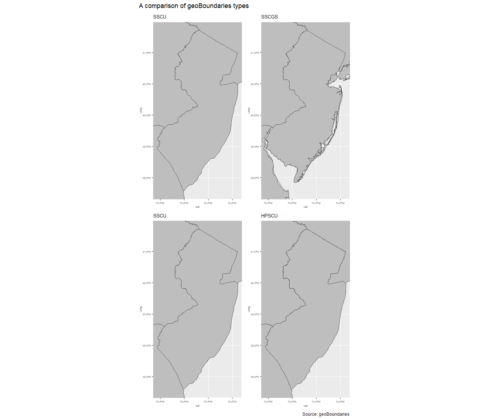
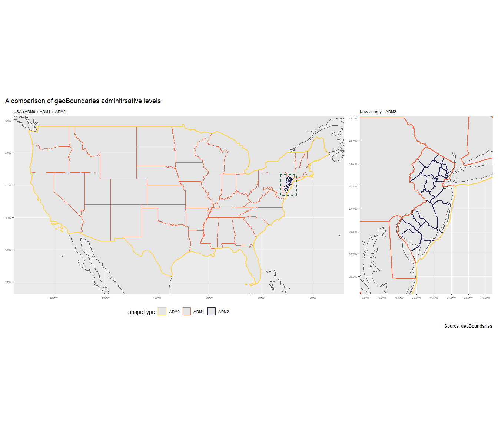

UrbanShift - Administrative boundaries
================
Saif Shabou
21 July 2021

-   [geoBoundaries database](#geoboundaries-database)
    -   [Description](#description)
    -   [File access](#file-access)
    -   [Programmatic / API Access](#programmatic--api-access)
    -   [File types comparison](#file-types-comparison)
    -   [Adminisrtative levels
        comparison](#adminisrtative-levels-comparison)

``` r
library(sf)
library(tidyverse)
library(leaflet)
library(htmltools)
library(httr)
library(jsonlite)
library(kableExtra)
library(rnaturalearth)
library(rnaturalearthdata)
library(cowplot)
library(patchwork)
library(maps)
```

# geoBoundaries database

## Description

[The geoBoundaries global database](https://www.geoboundaries.org/) is
an online, open license resource of boundaries (i.e., state, county) for
every country in the world. We currently track approximately 300,000
boundaries across 199 entities, including all 195 UN member states,
Greenland, Taiwan, Niue, and Kosovo. All boundaries are available to
view or download in common file formats, including shapefiles.It is
produced and maintained by the William & Mary
[geoLab](https://www.wm.edu/as/data-science/researchlabs/geolab/index.php)
since 2017. The code source of geoBoundaries is provided in this [github
repos](https://github.com/wmgeolab/geoBoundaries).

## File access

There are 3 different mechanisms to download geoBoundaries data:
`a web-based GUI`, `HTML file access (for archival versions)`, and an
`API`. Releases come in five different flavors:

-   *HPSCU - High Precision Single Country Unstadardized*: The highest
    precision files available for every country in the world. No
    standardization is performed on these files, so (for example) two
    countries may overlap in the case of contested boundaries.

-   *HPSCGS - High Precision Single Country Globally Standardized*: A
    standardized version of geoBoundaries high percision data, ensuring
    no contested boundaries or overlap in the dataset. This globally
    standardized product may have gaps between countries.

-   *SSCU - Simplified Single Country Unstandardized*: A simplified
    version of every file available for every country in the world. No
    standardization is performed on these files.

-   *SSCGS - Simplified Single Country Globally Standardized*: A
    standardized version of geoBoundaries simplified data, ensuring no
    contested boundaries or overlap in the dataset. This globally
    standardized product may have gaps between countries.

-   *CGAZ - Comprehensive Global Administrative Zones*: A global
    composite of the SSCGS ADM0, ADM1 and ADM2, with gaps filled between
    borders. Also available at higher levels of simplification.

## Programmatic / API Access

Full details on geoBoundaries API are available
[here](https://www.geoboundaries.org/api.html).

Information on every geoBoundary - current and past - can be retrieved
through a simple query; a JSON object is returned:

`https://www.geoboundaries.org/gbRequest.html?ISO=[3-LETTER-ISO-CODE]&ADM=[ADM-LEVEL]`

Users can also enter special phrases “ALL” for either “ADM” or “ISO” to
get a multi-boundary return (within the element ‘geoBoundaries’). A full
list of parameters users can include are:

-   *ISO* - Optional; defaults to ‘ALL’. The three-letter ISO code
    representing the country of interest. The special phrase ‘ALL’ can
    be entered to return all ISO codes in the database.
-   *ADM* - Optional; defaults to ‘ALL’. One of ADM0, ADM1, ADM2, ADM3,
    ADM4 or ADM5, representing each level of administrative hierarchy.
-   *VER* - Optional; defaults to the most recent version of
    geoBoundaries available. The geoboundaries version requested, with
    underscores. For example, 3\_0\_0 would return data from version
    3.0.0 of geoBoundaries.
-   *TYP* - Optional; defaults to HPSCU. One of `HPSCU`, `HPSCGS`,
    `SSCGS`, or `SSCU.` Determines the type of boundary link you
    receive.

The table below presents an example of a response from geoBoundaries API
(ISO=USA, ADM=ADM1, TYP=SSCU, VER=3\_0\_0)

``` r
geoboundary_call_SSCU =  "https://www.geoboundaries.org/gbRequest.html?ISO=USA&ADM=ADM1&TYP=SSCU&VER=3_0_0"
geoboundary_data_SSCU = fromJSON(geoboundary_call_SSCU, flatten = TRUE)

geoboundary_data_SSCU %>% 
  kable() %>%
  kable_styling(bootstrap_options = c("striped", "hover"), full_width = F, font_size = 13) %>% 
  scroll_box(width = "100%", height = "200px")
```

<div
style="border: 1px solid #ddd; padding: 0px; overflow-y: scroll; height:200px; overflow-x: scroll; width:100%; ">

<table class="table table-striped table-hover" style="font-size: 13px; width: auto !important; margin-left: auto; margin-right: auto;">
<thead>
<tr>
<th style="text-align:left;position: sticky; top:0; background-color: #FFFFFF;">
boundaryID
</th>
<th style="text-align:left;position: sticky; top:0; background-color: #FFFFFF;">
boundaryISO
</th>
<th style="text-align:left;position: sticky; top:0; background-color: #FFFFFF;">
boundaryYear
</th>
<th style="text-align:left;position: sticky; top:0; background-color: #FFFFFF;">
boundaryType
</th>
<th style="text-align:left;position: sticky; top:0; background-color: #FFFFFF;">
boundarySource-1
</th>
<th style="text-align:left;position: sticky; top:0; background-color: #FFFFFF;">
boundarySource-2
</th>
<th style="text-align:left;position: sticky; top:0; background-color: #FFFFFF;">
boundaryLicense
</th>
<th style="text-align:left;position: sticky; top:0; background-color: #FFFFFF;">
licenseDetail
</th>
<th style="text-align:left;position: sticky; top:0; background-color: #FFFFFF;">
licenseSource
</th>
<th style="text-align:left;position: sticky; top:0; background-color: #FFFFFF;">
boundarySourceURL
</th>
<th style="text-align:left;position: sticky; top:0; background-color: #FFFFFF;">
boundaryUpdate
</th>
<th style="text-align:left;position: sticky; top:0; background-color: #FFFFFF;">
downloadURL
</th>
<th style="text-align:left;position: sticky; top:0; background-color: #FFFFFF;">
gjDownloadURL
</th>
<th style="text-align:left;position: sticky; top:0; background-color: #FFFFFF;">
imagePreview
</th>
</tr>
</thead>
<tbody>
<tr>
<td style="text-align:left;">
USA-ADM1-3\_0\_0-G617
</td>
<td style="text-align:left;">
USA
</td>
<td style="text-align:left;">
2017.0
</td>
<td style="text-align:left;">
ADM1
</td>
<td style="text-align:left;">
US Census
</td>
<td style="text-align:left;">
</td>
<td style="text-align:left;">
Open Data Commons Open Database License 1.0
</td>
<td style="text-align:left;">
</td>
<td style="text-align:left;">
<https://www.census.gov/about/policies/open-gov/open-data.html>
</td>
<td style="text-align:left;">
<https://www.census.gov/geographies/mapping-files/time-series/geo/carto-boundary-file.html>
</td>
<td style="text-align:left;">
2020-05-25
</td>
<td style="text-align:left;">
<https://geoboundaries.org/data/geoBoundariesSSCU-3_0_0/USA/ADM1/geoBoundariesSSCU-3_0_0-USA-ADM1-all.zip>
</td>
<td style="text-align:left;">
<https://geoboundaries.org/data/geoBoundariesSSCU-3_0_0/USA/ADM1/geoBoundariesSSCU-3_0_0-USA-ADM1.geojson>
</td>
<td style="text-align:left;">
<https://geoboundaries.org/data/geoBoundariesSSCU-3_0_0/USA/ADM1/geoBoundariesPreviewSSCU-3_0_0-USA-ADM1.png>
</td>
</tr>
</tbody>
</table>

</div>

We can use th specified URL to download geojson file of the selected
entity.

``` r
geoboundary_geo_SSCU <- st_read(geoboundary_data_SSCU$gjDownloadURL, quiet = TRUE)

print(head(geoboundary_geo_SSCU))
```

    ## Simple feature collection with 6 features and 5 fields
    ## Geometry type: MULTIPOLYGON
    ## Dimension:     XY
    ## Bounding box:  xmin: -97.23907 ymin: 24.39631 xmax: -71.08857 ymax: 49.38437
    ## Geodetic CRS:  WGS 84
    ##       shapeName shapeISO           shapeID shapeGroup shapeType
    ## 1 West Virginia    US-WV USA-ADM1-3_0_0-B1        USA      ADM1
    ## 2       Florida    US-FL USA-ADM1-3_0_0-B2        USA      ADM1
    ## 3      Illinois    US-IL USA-ADM1-3_0_0-B3        USA      ADM1
    ## 4     Minnesota    US-MN USA-ADM1-3_0_0-B4        USA      ADM1
    ## 5      Maryland    US-MD USA-ADM1-3_0_0-B5        USA      ADM1
    ## 6  Rhode Island    US-RI USA-ADM1-3_0_0-B6        USA      ADM1
    ##                         geometry
    ## 1 MULTIPOLYGON (((-80.51899 4...
    ## 2 MULTIPOLYGON (((-82.98748 2...
    ## 3 MULTIPOLYGON (((-90.64285 4...
    ## 4 MULTIPOLYGON (((-97.22873 4...
    ## 5 MULTIPOLYGON (((-77.71952 3...
    ## 6 MULTIPOLYGON (((-71.67881 4...

## File types comparison

The map below presents USA administrative boundaries provided by
geoBoundaries API for the different file types: SSCGS, SSCU, HPSCGS and
HPSCU.

``` r
# colors specification

col_BoldRiverBlue = "#242456"
col_BoldSunYellow = "#FFD450"
col_BoldGrassGreen = "#2A553E"
col_BoldEarthGrey = "#7B7A66"
col_BoldBrickOrange = "#F26640"
col_LightRiverBlue = "#E3E6FF"
col_LightSunYellow = "#FFEDBA"
col_LightGrassGreen = "#C4F4D5"
col_LightEarthGrey = "#ECE2D6"
col_LightBrickOrange = "#FED3CF"
col_White = "#FFFFFF"
col_Black = "#000000"

# get world map
world <- ne_countries(scale = "medium", returnclass = "sf")

# get data
geoboundary_call_SSCU =  "https://www.geoboundaries.org/gbRequest.html?ISO=USA&ADM=ADM1&TYP=SSCU&VER=3_0_0"
geoboundary_call_HPSCU =  "https://www.geoboundaries.org/gbRequest.html?ISO=USA&ADM=ADM1&TYP=HPSCU&VER=3_0_0"
geoboundary_call_SSCGS =  "https://www.geoboundaries.org/gbRequest.html?ISO=USA&ADM=ADM1&TYP=SSCGS&VER=3_0_0"
geoboundary_call_HPSCGS =  "https://www.geoboundaries.org/gbRequest.html?ISO=USA&ADM=ADM1&TYP=HPSCGS&VER=3_0_0"

# get geojson data
geoboundary_data_SSCU = fromJSON(geoboundary_call_SSCU, flatten = TRUE)
geoboundary_data_HPSCU = fromJSON(geoboundary_call_HPSCU, flatten = TRUE)
geoboundary_data_SSCGS = fromJSON(geoboundary_call_SSCGS, flatten = TRUE)
geoboundary_data_HPSCGS = fromJSON(geoboundary_call_HPSCGS, flatten = TRUE)

# get geojson
geoboundary_geo_SSCU <- st_read(geoboundary_data_SSCU$gjDownloadURL, quiet = TRUE)
geoboundary_geo_HPSCU <- st_read(geoboundary_data_HPSCU$gjDownloadURL, quiet = TRUE)
geoboundary_geo_SSCGS <- st_read(geoboundary_data_SSCGS$gjDownloadURL, quiet = TRUE)
geoboundary_geo_HPSCGS <- st_read(geoboundary_data_HPSCGS$gjDownloadURL, quiet = TRUE)

# extract bbox
geoboundary_geo_SSCU = geoboundary_geo_SSCU %>% 
  filter(! shapeName %in% c("Alaska","Hawaii","American Samoa","United States Virgin Islands",
                            "Commonwealth of the Northern Mariana Islands","Guam","Puerto Rico"))

geoboundary_geo_bbox_New_jersey = st_bbox(geoboundary_geo_SSCU[geoboundary_geo_SSCU$shapeName == "New Jersey", ])


# geoboundary_geo_SSCU_map
geoboundary_geo_SSCU_map = ggplot(data = world) +
  geom_sf() +
  geom_sf(data = geoboundary_geo_SSCU, fill = "gray") +
  coord_sf(xlim = c(geoboundary_geo_bbox_New_jersey$xmin, 
                    geoboundary_geo_bbox_New_jersey$xmax), 
           ylim = c(geoboundary_geo_bbox_New_jersey$ymin, 
                    geoboundary_geo_bbox_New_jersey$ymax),
           expand = TRUE) +
  labs(title = "SSCU",x = "Lat",y = "Long") + 
  theme(axis.text = element_text(size = 5),
        axis.title = element_text(size = 5),
        plot.title = element_text(size = 10),
        legend.text = element_text(size = 5))

# geoboundary_geo_SSCGS_map
geoboundary_geo_SSCGS_map = ggplot(data = world) +
  geom_sf() +
  geom_sf(data = geoboundary_geo_SSCGS, fill = "gray") +
  coord_sf(xlim = c(geoboundary_geo_bbox_New_jersey$xmin, 
                    geoboundary_geo_bbox_New_jersey$xmax), 
           ylim = c(geoboundary_geo_bbox_New_jersey$ymin, 
                    geoboundary_geo_bbox_New_jersey$ymax),
           expand = TRUE) +
  labs(title = "SSCGS",x = "Lat",y = "Long") + 
  theme(axis.text = element_text(size = 5),
        axis.title = element_text(size = 5),
        plot.title = element_text(size = 10),
        legend.text = element_text(size = 5)) 

# geoboundary_geo_HPSCU
geoboundary_geo_HPSCU_map = ggplot(data = world) +
  geom_sf() +
  geom_sf(data = geoboundary_geo_HPSCU, fill = "gray") +
  coord_sf(xlim = c(geoboundary_geo_bbox_New_jersey$xmin, 
                    geoboundary_geo_bbox_New_jersey$xmax), 
           ylim = c(geoboundary_geo_bbox_New_jersey$ymin, 
                    geoboundary_geo_bbox_New_jersey$ymax),
           expand = TRUE) +
  labs(title = "HPSCU",x = "Lat",y = "Long") + 
  theme(axis.text = element_text(size = 5),
        axis.title = element_text(size = 5),
        plot.title = element_text(size = 10),
        legend.text = element_text(size = 5))

# geoboundary_geo_HPSCGS
geoboundary_geo_HPSCGS_map = ggplot(data = world) +
  geom_sf() +
  geom_sf(data = geoboundary_geo_HPSCGS, fill = "gray") +
  coord_sf(xlim = c(geoboundary_geo_bbox_New_jersey$xmin, 
                    geoboundary_geo_bbox_New_jersey$xmax), 
           ylim = c(geoboundary_geo_bbox_New_jersey$ymin, 
                    geoboundary_geo_bbox_New_jersey$ymax),
           expand = TRUE) +
  labs(title = "HPSCGS",x = "Lat",y = "Long") + 
  theme(axis.text = element_text(size = 5),
        axis.title = element_text(size = 5),
        plot.title = element_text(size = 10),
        legend.text = element_text(size = 5))


# plot all

geoboundary_geo_map = geoboundary_geo_SSCU_map + 
  geoboundary_geo_SSCGS_map + 
  geoboundary_geo_SSCU_map + 
  geoboundary_geo_HPSCU_map +
  plot_annotation(
    title = "A comparison of geoBoundaries types",
    caption = "Source: geoBoundaries"
  )

geoboundary_geo_map
```

<!-- -->

## Adminisrtative levels comparison

The map below presents USA administrative boundaries provided by
geoBoundaries API for the different administrative levels: National
(ADM0), states (ADM1), and countyes (ADM2).

``` r
geoboundary_call_ADM =  "https://www.geoboundaries.org/gbRequest.html?ISO=USA&ADM=ALL&TYP=SSCU&VER=3_0_0"
geoboundary_data_ADM = fromJSON(geoboundary_call_ADM, flatten = TRUE)

geoboundary_geo_ADM0 <- st_read(geoboundary_data_ADM[geoboundary_data_ADM$boundaryType=="ADM0","gjDownloadURL"], quiet = TRUE)
geoboundary_geo_ADM1 <- st_read(geoboundary_data_ADM[geoboundary_data_ADM$boundaryType=="ADM1","gjDownloadURL"], quiet = TRUE)
geoboundary_geo_ADM2 <- st_read(geoboundary_data_ADM[geoboundary_data_ADM$boundaryType=="ADM2","gjDownloadURL"], quiet = TRUE)


geoboundary_geo_ADM = geoboundary_geo_ADM2 %>% 
  # subset counties within New Jersey
  st_intersection(geoboundary_geo_ADM1[geoboundary_geo_ADM1$shapeName == "New Jersey", ]) %>% 
  select(shapeName,shapeISO,shapeID,shapeGroup,shapeType,geometry) %>% 
  bind_rows(geoboundary_geo_ADM0,geoboundary_geo_ADM1)


# extract bbox
geoboundary_geo_subset = geoboundary_geo_ADM1 %>% 
  filter(! shapeName %in% c("Alaska","Hawaii","American Samoa","United States Virgin Islands",
                            "Commonwealth of the Northern Mariana Islands","Guam","Puerto Rico"))

geoboundary_geo_bbox = st_bbox(geoboundary_geo_subset)


# geoboundary_geo_ADM0_ADM1
geoboundary_geo_ADM_plot = ggplot(data = world) +
  geom_sf() +
  geom_sf(data = geoboundary_geo_ADM, aes(color = shapeType)) +
  geom_sf(data = geoboundary_geo_ADM0, colour = col_BoldSunYellow , fill = NA, lwd = 1, aes(color = col_BoldSunYellow)) +
  geom_rect(xmin = geoboundary_geo_bbox_New_jersey$xmin-0.7, 
            xmax = geoboundary_geo_bbox_New_jersey$xmax+0.7, 
            ymin = geoboundary_geo_bbox_New_jersey$ymin-0.3, 
            ymax = geoboundary_geo_bbox_New_jersey$ymax+0.3, 
            fill = NA, colour = col_BoldGrassGreen, size = 1.2, linetype = "dotted") +
  coord_sf(xlim = c(geoboundary_geo_bbox$xmin, 
                    geoboundary_geo_bbox$xmax), 
           ylim = c(geoboundary_geo_bbox$ymin, 
                    geoboundary_geo_bbox$ymax),
           expand = TRUE) +
  labs(title = "USA (ADM0 + ADM1 + ADM2") +
  theme(axis.text = element_text(size = 5),
        axis.title = element_text(size = 5),
        plot.title = element_text(size = 8),
        legend.position = "bottom",
        legend.text = element_text(size = 8)) +
  scale_colour_manual(values = c(col_BoldSunYellow,col_BoldBrickOrange,col_BoldRiverBlue),
                      labels = c("ADM0","ADM1","ADM2"))


# geoboundary_geo_ADM2
geoboundary_geo_ADM2_plot = ggplot(data = world) +
  geom_sf() +
  geom_sf(data = geoboundary_geo_ADM, colour = col_BoldRiverBlue , fill = NA, lwd = 1) +
  geom_sf(data = geoboundary_geo_ADM1, colour = col_BoldBrickOrange , fill = NA, lwd = 1) +
  geom_sf(data = geoboundary_geo_ADM0, colour = col_BoldSunYellow , fill = NA, lwd = 1) +
  coord_sf(xlim = c(geoboundary_geo_bbox_New_jersey$xmin-0.9, 
                    geoboundary_geo_bbox_New_jersey$xmax+0.9), 
           ylim = c(geoboundary_geo_bbox_New_jersey$ymin-0.5, 
                    geoboundary_geo_bbox_New_jersey$ymax+0.5),
           expand = TRUE) +
  labs(title = "New Jersey - ADM2") + 
  theme(axis.text = element_text(size = 5),
        axis.title = element_text(size = 5),
        plot.title = element_text(size = 8))


# plot all

geoboundary_geo_map_AdmLevel = geoboundary_geo_ADM_plot + geoboundary_geo_ADM2_plot + 
  plot_annotation(
    title = "A comparison of geoBoundaries adminitrsative levels",
    caption = "Source: geoBoundaries"
  )

geoboundary_geo_map_AdmLevel
```

<!-- -->
