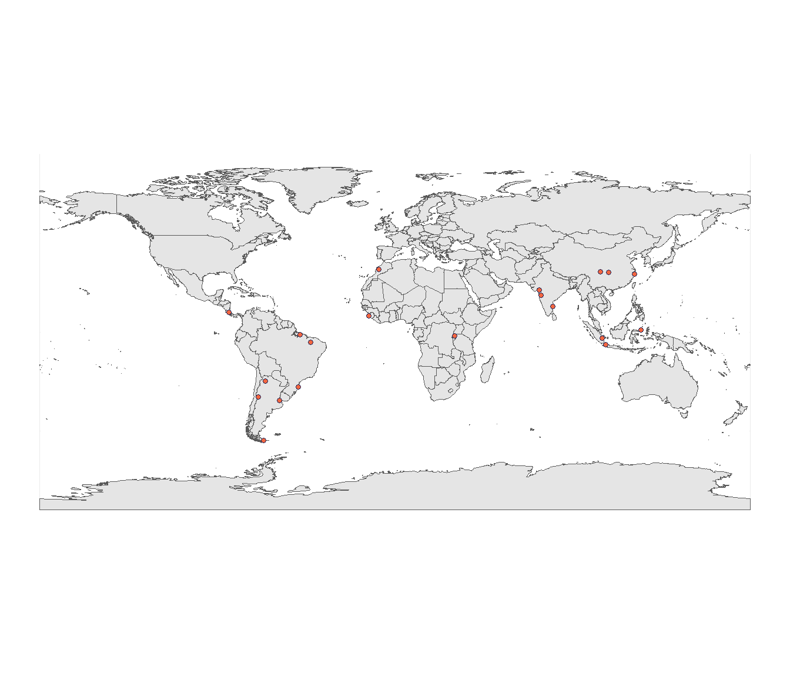

UrbanShift - Administrative boundaries
================
Saif Shabou
22 July 2021

``` r
library(sf)
library(tidyverse)
library(leaflet)
library(htmltools)
library(httr)
library(jsonlite)
library(kableExtra)
library(rnaturalearth)
library(rnaturalearthdata)
library(cowplot)
library(patchwork)
library(maps)
```

# Application to UrbanShift cities

``` r
# get world map
world <- ne_countries(scale = "medium", returnclass = "sf")

# load data Urbanshift cities geojson


UrbanShift_cities <- st_read("https://raw.githubusercontent.com/wri/cities-urbanshift/main/geospatial-layers/data/raw/administrative-boundaries/urbanshift-cities/UrbanShift_cities.geojson",
                             quiet = TRUE)

UrbanShift_cities %>%
  kable() %>%
  kable_styling(bootstrap_options = c("striped", "hover"), full_width = F, font_size = 13) %>%
  scroll_box(width = "100%", height = "400px")
```

<div
style="border: 1px solid #ddd; padding: 0px; overflow-y: scroll; height:400px; overflow-x: scroll; width:100%; ">

<table class="table table-striped table-hover" style="font-size: 13px; width: auto !important; margin-left: auto; margin-right: auto;">
<thead>
<tr>
<th style="text-align:left;position: sticky; top:0; background-color: #FFFFFF;">
country\_iso
</th>
<th style="text-align:left;position: sticky; top:0; background-color: #FFFFFF;">
id
</th>
<th style="text-align:left;position: sticky; top:0; background-color: #FFFFFF;">
name
</th>
<th style="text-align:left;position: sticky; top:0; background-color: #FFFFFF;">
shapeGroup
</th>
<th style="text-align:left;position: sticky; top:0; background-color: #FFFFFF;">
shapeID
</th>
<th style="text-align:left;position: sticky; top:0; background-color: #FFFFFF;">
shapeISO
</th>
<th style="text-align:left;position: sticky; top:0; background-color: #FFFFFF;">
shapeName
</th>
<th style="text-align:left;position: sticky; top:0; background-color: #FFFFFF;">
shapeType
</th>
<th style="text-align:left;position: sticky; top:0; background-color: #FFFFFF;">
ADM0\_shape
</th>
<th style="text-align:left;position: sticky; top:0; background-color: #FFFFFF;">
ADM1\_sha\_1
</th>
<th style="text-align:left;position: sticky; top:0; background-color: #FFFFFF;">
ADM1\_shape
</th>
<th style="text-align:left;position: sticky; top:0; background-color: #FFFFFF;">
ADMHIERARC
</th>
<th style="text-align:left;position: sticky; top:0; background-color: #FFFFFF;">
geometry
</th>
</tr>
</thead>
<tbody>
<tr>
<td style="text-align:left;">
ARG
</td>
<td style="text-align:left;">
ARG-Mendoza
</td>
<td style="text-align:left;">
Mendoza
</td>
<td style="text-align:left;">
NA
</td>
<td style="text-align:left;">
NA
</td>
<td style="text-align:left;">
NA
</td>
<td style="text-align:left;">
NA
</td>
<td style="text-align:left;">
NA
</td>
<td style="text-align:left;">
NA
</td>
<td style="text-align:left;">
NA
</td>
<td style="text-align:left;">
NA
</td>
<td style="text-align:left;">
NA
</td>
<td style="text-align:left;">
POLYGON ((-70.09376 -33.051…
</td>
</tr>
<tr>
<td style="text-align:left;">
ARG
</td>
<td style="text-align:left;">
ARG-Mar\_del\_Plata
</td>
<td style="text-align:left;">
Mar del Plata
</td>
<td style="text-align:left;">
ARG
</td>
<td style="text-align:left;">
ARG-ADM2-1590546715-B389
</td>
<td style="text-align:left;">
ARG
</td>
<td style="text-align:left;">
Partido de General Pueyrred&lt;U+FFFD&gt;n
</td>
<td style="text-align:left;">
ADM2
</td>
<td style="text-align:left;">
NA
</td>
<td style="text-align:left;">
NA
</td>
<td style="text-align:left;">
NA
</td>
<td style="text-align:left;">
NA
</td>
<td style="text-align:left;">
GEOMETRYCOLLECTION (LINESTR…
</td>
</tr>
<tr>
<td style="text-align:left;">
ARG
</td>
<td style="text-align:left;">
ARG-Ushuaia
</td>
<td style="text-align:left;">
Ushuaia
</td>
<td style="text-align:left;">
ARG
</td>
<td style="text-align:left;">
ARG-ADM2-1590546715-B99
</td>
<td style="text-align:left;">
ARG
</td>
<td style="text-align:left;">
Departamento Ushuaia
</td>
<td style="text-align:left;">
ADM2
</td>
<td style="text-align:left;">
NA
</td>
<td style="text-align:left;">
NA
</td>
<td style="text-align:left;">
NA
</td>
<td style="text-align:left;">
NA
</td>
<td style="text-align:left;">
MULTIPOLYGON (((-64.35062 -…
</td>
</tr>
<tr>
<td style="text-align:left;">
ARG
</td>
<td style="text-align:left;">
ARG-Salta
</td>
<td style="text-align:left;">
Salta
</td>
<td style="text-align:left;">
NA
</td>
<td style="text-align:left;">
NA
</td>
<td style="text-align:left;">
NA
</td>
<td style="text-align:left;">
NA
</td>
<td style="text-align:left;">
NA
</td>
<td style="text-align:left;">
NA
</td>
<td style="text-align:left;">
NA
</td>
<td style="text-align:left;">
NA
</td>
<td style="text-align:left;">
NA
</td>
<td style="text-align:left;">
POLYGON ((-65.53171 -25.026…
</td>
</tr>
<tr>
<td style="text-align:left;">
ARG
</td>
<td style="text-align:left;">
ARG-Buenos\_Aires
</td>
<td style="text-align:left;">
Buenos Aires
</td>
<td style="text-align:left;">
NA
</td>
<td style="text-align:left;">
NA
</td>
<td style="text-align:left;">
NA
</td>
<td style="text-align:left;">
NA
</td>
<td style="text-align:left;">
NA
</td>
<td style="text-align:left;">
NA
</td>
<td style="text-align:left;">
NA
</td>
<td style="text-align:left;">
NA
</td>
<td style="text-align:left;">
NA
</td>
<td style="text-align:left;">
MULTIPOLYGON (((-58.36618 -…
</td>
</tr>
<tr>
<td style="text-align:left;">
BRA
</td>
<td style="text-align:left;">
BRA-Teresina
</td>
<td style="text-align:left;">
Teresina
</td>
<td style="text-align:left;">
NA
</td>
<td style="text-align:left;">
NA
</td>
<td style="text-align:left;">
NA
</td>
<td style="text-align:left;">
NA
</td>
<td style="text-align:left;">
NA
</td>
<td style="text-align:left;">
NA
</td>
<td style="text-align:left;">
NA
</td>
<td style="text-align:left;">
NA
</td>
<td style="text-align:left;">
NA
</td>
<td style="text-align:left;">
POLYGON ((-42.599 -5.349998…
</td>
</tr>
<tr>
<td style="text-align:left;">
BRA
</td>
<td style="text-align:left;">
BRA-Florianopolois
</td>
<td style="text-align:left;">
Florianopolois
</td>
<td style="text-align:left;">
NA
</td>
<td style="text-align:left;">
NA
</td>
<td style="text-align:left;">
NA
</td>
<td style="text-align:left;">
NA
</td>
<td style="text-align:left;">
NA
</td>
<td style="text-align:left;">
NA
</td>
<td style="text-align:left;">
NA
</td>
<td style="text-align:left;">
NA
</td>
<td style="text-align:left;">
NA
</td>
<td style="text-align:left;">
MULTIPOLYGON (((-48.58167 -…
</td>
</tr>
<tr>
<td style="text-align:left;">
BRA
</td>
<td style="text-align:left;">
BRA-Belem
</td>
<td style="text-align:left;">
Belem
</td>
<td style="text-align:left;">
NA
</td>
<td style="text-align:left;">
NA
</td>
<td style="text-align:left;">
NA
</td>
<td style="text-align:left;">
NA
</td>
<td style="text-align:left;">
NA
</td>
<td style="text-align:left;">
NA
</td>
<td style="text-align:left;">
NA
</td>
<td style="text-align:left;">
NA
</td>
<td style="text-align:left;">
NA
</td>
<td style="text-align:left;">
MULTIPOLYGON (((-48.54139 -…
</td>
</tr>
<tr>
<td style="text-align:left;">
CRI
</td>
<td style="text-align:left;">
CRI-San\_Jose
</td>
<td style="text-align:left;">
San Jose
</td>
<td style="text-align:left;">
NA
</td>
<td style="text-align:left;">
NA
</td>
<td style="text-align:left;">
NA
</td>
<td style="text-align:left;">
NA
</td>
<td style="text-align:left;">
NA
</td>
<td style="text-align:left;">
NA
</td>
<td style="text-align:left;">
NA
</td>
<td style="text-align:left;">
NA
</td>
<td style="text-align:left;">
NA
</td>
<td style="text-align:left;">
POLYGON ((-83.76411 9.60485…
</td>
</tr>
<tr>
<td style="text-align:left;">
RWA
</td>
<td style="text-align:left;">
RWA-Kigali
</td>
<td style="text-align:left;">
Kigali
</td>
<td style="text-align:left;">
RWA
</td>
<td style="text-align:left;">
RWA-ADM1-1590546715-B4
</td>
<td style="text-align:left;">
RW-01
</td>
<td style="text-align:left;">
Kigali City
</td>
<td style="text-align:left;">
ADM1
</td>
<td style="text-align:left;">
NA
</td>
<td style="text-align:left;">
NA
</td>
<td style="text-align:left;">
NA
</td>
<td style="text-align:left;">
NA
</td>
<td style="text-align:left;">
POLYGON ((29.97953 -1.88663…
</td>
</tr>
<tr>
<td style="text-align:left;">
SLE
</td>
<td style="text-align:left;">
SLE-Freetown\_region
</td>
<td style="text-align:left;">
Freetown Region
</td>
<td style="text-align:left;">
SLE
</td>
<td style="text-align:left;">
SLE-ADM1-1590546715-B3
</td>
<td style="text-align:left;">
SL-W
</td>
<td style="text-align:left;">
Western Area
</td>
<td style="text-align:left;">
ADM1
</td>
<td style="text-align:left;">
NA
</td>
<td style="text-align:left;">
NA
</td>
<td style="text-align:left;">
NA
</td>
<td style="text-align:left;">
NA
</td>
<td style="text-align:left;">
MULTIPOLYGON (((-13.1676 8….
</td>
</tr>
<tr>
<td style="text-align:left;">
MAR
</td>
<td style="text-align:left;">
MAR-Marrakech
</td>
<td style="text-align:left;">
Marrakech
</td>
<td style="text-align:left;">
MAR
</td>
<td style="text-align:left;">
MAR-ADM2-1590546715-B42
</td>
<td style="text-align:left;">
None
</td>
<td style="text-align:left;">
Pr&lt;U+FFFD&gt;fecture de Marrakech ????? ?????
</td>
<td style="text-align:left;">
ADM2
</td>
<td style="text-align:left;">
NA
</td>
<td style="text-align:left;">
NA
</td>
<td style="text-align:left;">
NA
</td>
<td style="text-align:left;">
NA
</td>
<td style="text-align:left;">
POLYGON ((-8.42606 31.80765…
</td>
</tr>
<tr>
<td style="text-align:left;">
IND
</td>
<td style="text-align:left;">
IND-Chennai
</td>
<td style="text-align:left;">
Chennai
</td>
<td style="text-align:left;">
NA
</td>
<td style="text-align:left;">
NA
</td>
<td style="text-align:left;">
NA
</td>
<td style="text-align:left;">
NA
</td>
<td style="text-align:left;">
NA
</td>
<td style="text-align:left;">
NA
</td>
<td style="text-align:left;">
NA
</td>
<td style="text-align:left;">
NA
</td>
<td style="text-align:left;">
NA
</td>
<td style="text-align:left;">
MULTIPOLYGON (((79.84137 13…
</td>
</tr>
<tr>
<td style="text-align:left;">
IND
</td>
<td style="text-align:left;">
IND-Pune
</td>
<td style="text-align:left;">
Pune
</td>
<td style="text-align:left;">
IND
</td>
<td style="text-align:left;">
IND-ADM2-1590546715-B452
</td>
<td style="text-align:left;">
None
</td>
<td style="text-align:left;">
Pune
</td>
<td style="text-align:left;">
ADM2
</td>
<td style="text-align:left;">
NA
</td>
<td style="text-align:left;">
NA
</td>
<td style="text-align:left;">
NA
</td>
<td style="text-align:left;">
NA
</td>
<td style="text-align:left;">
POLYGON ((73.32223 18.57061…
</td>
</tr>
<tr>
<td style="text-align:left;">
IND
</td>
<td style="text-align:left;">
IND-Surat
</td>
<td style="text-align:left;">
Surat
</td>
<td style="text-align:left;">
IND
</td>
<td style="text-align:left;">
IND-ADM2-1590546715-B555
</td>
<td style="text-align:left;">
None
</td>
<td style="text-align:left;">
Surat
</td>
<td style="text-align:left;">
ADM2
</td>
<td style="text-align:left;">
NA
</td>
<td style="text-align:left;">
NA
</td>
<td style="text-align:left;">
NA
</td>
<td style="text-align:left;">
NA
</td>
<td style="text-align:left;">
MULTIPOLYGON (((72.67846 21…
</td>
</tr>
<tr>
<td style="text-align:left;">
CHN
</td>
<td style="text-align:left;">
CHN-Chengdu
</td>
<td style="text-align:left;">
Chengdu
</td>
<td style="text-align:left;">
NA
</td>
<td style="text-align:left;">
NA
</td>
<td style="text-align:left;">
NA
</td>
<td style="text-align:left;">
NA
</td>
<td style="text-align:left;">
NA
</td>
<td style="text-align:left;">
NA
</td>
<td style="text-align:left;">
NA
</td>
<td style="text-align:left;">
NA
</td>
<td style="text-align:left;">
NA
</td>
<td style="text-align:left;">
MULTIPOLYGON (((105.5755 30…
</td>
</tr>
<tr>
<td style="text-align:left;">
CHN
</td>
<td style="text-align:left;">
CHN-Chongqing
</td>
<td style="text-align:left;">
Chongqing
</td>
<td style="text-align:left;">
CHN
</td>
<td style="text-align:left;">
CHN-ADM2-3\_0\_0-B306
</td>
<td style="text-align:left;">
None
</td>
<td style="text-align:left;">
Enshi Tujia and Miao Autonomous Prefecture
</td>
<td style="text-align:left;">
ADM2
</td>
<td style="text-align:left;">
CHN-ADM0-3\_0\_0-B1
</td>
<td style="text-align:left;">
Hubei
</td>
<td style="text-align:left;">
CHN-ADM1-3\_0\_0-B16
</td>
<td style="text-align:left;">
CHN-ADM2-3\_0\_0-B306\|CHN-ADM1-3\_0\_0-B16\|CHN-ADM0-3\_0\_0-B1
</td>
<td style="text-align:left;">
POLYGON ((105.2868 29.5554,…
</td>
</tr>
<tr>
<td style="text-align:left;">
CHN
</td>
<td style="text-align:left;">
CHN-Ningbo
</td>
<td style="text-align:left;">
Ningbo
</td>
<td style="text-align:left;">
NA
</td>
<td style="text-align:left;">
NA
</td>
<td style="text-align:left;">
NA
</td>
<td style="text-align:left;">
NA
</td>
<td style="text-align:left;">
NA
</td>
<td style="text-align:left;">
NA
</td>
<td style="text-align:left;">
NA
</td>
<td style="text-align:left;">
NA
</td>
<td style="text-align:left;">
NA
</td>
<td style="text-align:left;">
MULTIPOLYGON (((121.0873 30…
</td>
</tr>
<tr>
<td style="text-align:left;">
IDN
</td>
<td style="text-align:left;">
IDN-Jakarta
</td>
<td style="text-align:left;">
Jakarta
</td>
<td style="text-align:left;">
NA
</td>
<td style="text-align:left;">
NA
</td>
<td style="text-align:left;">
NA
</td>
<td style="text-align:left;">
NA
</td>
<td style="text-align:left;">
NA
</td>
<td style="text-align:left;">
NA
</td>
<td style="text-align:left;">
NA
</td>
<td style="text-align:left;">
NA
</td>
<td style="text-align:left;">
NA
</td>
<td style="text-align:left;">
MULTIPOLYGON (((106.729 -6….
</td>
</tr>
<tr>
<td style="text-align:left;">
IDN
</td>
<td style="text-align:left;">
IDN-Bitung
</td>
<td style="text-align:left;">
Bitung
</td>
<td style="text-align:left;">
NA
</td>
<td style="text-align:left;">
NA
</td>
<td style="text-align:left;">
NA
</td>
<td style="text-align:left;">
NA
</td>
<td style="text-align:left;">
NA
</td>
<td style="text-align:left;">
NA
</td>
<td style="text-align:left;">
NA
</td>
<td style="text-align:left;">
NA
</td>
<td style="text-align:left;">
NA
</td>
<td style="text-align:left;">
MULTIPOLYGON (((125.2826 1….
</td>
</tr>
<tr>
<td style="text-align:left;">
IDN
</td>
<td style="text-align:left;">
IDN-Semarang
</td>
<td style="text-align:left;">
Semarang
</td>
<td style="text-align:left;">
NA
</td>
<td style="text-align:left;">
NA
</td>
<td style="text-align:left;">
NA
</td>
<td style="text-align:left;">
NA
</td>
<td style="text-align:left;">
NA
</td>
<td style="text-align:left;">
NA
</td>
<td style="text-align:left;">
NA
</td>
<td style="text-align:left;">
NA
</td>
<td style="text-align:left;">
NA
</td>
<td style="text-align:left;">
GEOMETRYCOLLECTION (LINESTR…
</td>
</tr>
<tr>
<td style="text-align:left;">
IDN
</td>
<td style="text-align:left;">
IDN-Balikpapan
</td>
<td style="text-align:left;">
Balikpapan
</td>
<td style="text-align:left;">
IDN
</td>
<td style="text-align:left;">
IDN-ADM2-1590546715-B175
</td>
<td style="text-align:left;">
None
</td>
<td style="text-align:left;">
Kota Balikpapan
</td>
<td style="text-align:left;">
ADM2
</td>
<td style="text-align:left;">
NA
</td>
<td style="text-align:left;">
NA
</td>
<td style="text-align:left;">
NA
</td>
<td style="text-align:left;">
NA
</td>
<td style="text-align:left;">
GEOMETRYCOLLECTION (LINESTR…
</td>
</tr>
<tr>
<td style="text-align:left;">
IDN
</td>
<td style="text-align:left;">
IDN-Palembang
</td>
<td style="text-align:left;">
Palembang
</td>
<td style="text-align:left;">
NA
</td>
<td style="text-align:left;">
NA
</td>
<td style="text-align:left;">
NA
</td>
<td style="text-align:left;">
NA
</td>
<td style="text-align:left;">
NA
</td>
<td style="text-align:left;">
NA
</td>
<td style="text-align:left;">
NA
</td>
<td style="text-align:left;">
NA
</td>
<td style="text-align:left;">
NA
</td>
<td style="text-align:left;">
MULTIPOLYGON (((104.7551 -2…
</td>
</tr>
</tbody>
</table>

</div>

``` r
# load data Urbanshift secondary cities geojson

UrbanShift_secondarycities <- st_read("https://raw.githubusercontent.com/wri/cities-urbanshift/main/geospatial-layers/data/raw/administrative-boundaries/urbanshift-cities/UrbanShift_secondarycities.geojson",
                             quiet = TRUE)

UrbanShift_secondarycities %>%
  kable() %>%
  kable_styling(bootstrap_options = c("striped", "hover"), full_width = F, font_size = 13) %>%
  scroll_box(width = "100%", height = "400px")
```

<div
style="border: 1px solid #ddd; padding: 0px; overflow-y: scroll; height:400px; overflow-x: scroll; width:100%; ">

<table class="table table-striped table-hover" style="font-size: 13px; width: auto !important; margin-left: auto; margin-right: auto;">
<thead>
<tr>
<th style="text-align:left;position: sticky; top:0; background-color: #FFFFFF;">
id
</th>
<th style="text-align:left;position: sticky; top:0; background-color: #FFFFFF;">
shapeGroup
</th>
<th style="text-align:left;position: sticky; top:0; background-color: #FFFFFF;">
shapeID
</th>
<th style="text-align:left;position: sticky; top:0; background-color: #FFFFFF;">
shapeISO
</th>
<th style="text-align:left;position: sticky; top:0; background-color: #FFFFFF;">
shapeName
</th>
<th style="text-align:left;position: sticky; top:0; background-color: #FFFFFF;">
shapeType
</th>
<th style="text-align:left;position: sticky; top:0; background-color: #FFFFFF;">
geometry
</th>
</tr>
</thead>
<tbody>
<tr>
<td style="text-align:left;">
0\_00000000000000000094
</td>
<td style="text-align:left;">
SLE
</td>
<td style="text-align:left;">
SLE-ADM3-1590546715-B149
</td>
<td style="text-align:left;">
None
</td>
<td style="text-align:left;">
Makeni Town
</td>
<td style="text-align:left;">
ADM3
</td>
<td style="text-align:left;">
MULTIPOLYGON (((-12.06385 8…
</td>
</tr>
<tr>
<td style="text-align:left;">
1\_0000000000000000000c
</td>
<td style="text-align:left;">
SLE
</td>
<td style="text-align:left;">
SLE-ADM2-1590546715-B13
</td>
<td style="text-align:left;">
None
</td>
<td style="text-align:left;">
Western Area Rural
</td>
<td style="text-align:left;">
ADM2
</td>
<td style="text-align:left;">
MULTIPOLYGON (((-13.1676 8….
</td>
</tr>
<tr>
<td style="text-align:left;">
2\_00000000000000000025
</td>
<td style="text-align:left;">
SLE
</td>
<td style="text-align:left;">
SLE-ADM3-1590546715-B95
</td>
<td style="text-align:left;">
None
</td>
<td style="text-align:left;">
Bo Town
</td>
<td style="text-align:left;">
ADM3
</td>
<td style="text-align:left;">
MULTIPOLYGON (((-11.76177 7…
</td>
</tr>
<tr>
<td style="text-align:left;">
3\_0000000000000000000b
</td>
<td style="text-align:left;">
SLE
</td>
<td style="text-align:left;">
SLE-ADM3-1590546715-B69
</td>
<td style="text-align:left;">
None
</td>
<td style="text-align:left;">
Kenema Town
</td>
<td style="text-align:left;">
ADM3
</td>
<td style="text-align:left;">
MULTIPOLYGON (((-11.21412 7…
</td>
</tr>
<tr>
<td style="text-align:left;">
4\_0000000000000000007a
</td>
<td style="text-align:left;">
SLE
</td>
<td style="text-align:left;">
SLE-ADM3-1590546715-B123
</td>
<td style="text-align:left;">
None
</td>
<td style="text-align:left;">
Koidu Town
</td>
<td style="text-align:left;">
ADM3
</td>
<td style="text-align:left;">
MULTIPOLYGON (((-11.00093 8…
</td>
</tr>
<tr>
<td style="text-align:left;">
5\_0000000000000000005c
</td>
<td style="text-align:left;">
SLE
</td>
<td style="text-align:left;">
SLE-ADM3-1590546715-B36
</td>
<td style="text-align:left;">
None
</td>
<td style="text-align:left;">
Bonthe Urban
</td>
<td style="text-align:left;">
ADM3
</td>
<td style="text-align:left;">
MULTIPOLYGON (((-12.49656 7…
</td>
</tr>
<tr>
<td style="text-align:left;">
6\_000000000000000002ec
</td>
<td style="text-align:left;">
SLE
</td>
<td style="text-align:left;">
SLE-ADM4-1590546715-B800
</td>
<td style="text-align:left;">
None
</td>
<td style="text-align:left;">
Sanda
</td>
<td style="text-align:left;">
ADM4
</td>
<td style="text-align:left;">
MULTIPOLYGON (((-12.79277 8…
</td>
</tr>
<tr>
<td style="text-align:left;">
6\_000000000000000002d5
</td>
<td style="text-align:left;">
SLE
</td>
<td style="text-align:left;">
SLE-ADM4-1590546715-B777
</td>
<td style="text-align:left;">
None
</td>
<td style="text-align:left;">
Falaba
</td>
<td style="text-align:left;">
ADM4
</td>
<td style="text-align:left;">
MULTIPOLYGON (((-12.78948 8…
</td>
</tr>
<tr>
<td style="text-align:left;">
6\_000000000000000002dd
</td>
<td style="text-align:left;">
SLE
</td>
<td style="text-align:left;">
SLE-ADM4-1590546715-B785
</td>
<td style="text-align:left;">
None
</td>
<td style="text-align:left;">
Kondato
</td>
<td style="text-align:left;">
ADM4
</td>
<td style="text-align:left;">
MULTIPOLYGON (((-12.78944 8…
</td>
</tr>
<tr>
<td style="text-align:left;">
6\_000000000000000002ee
</td>
<td style="text-align:left;">
SLE
</td>
<td style="text-align:left;">
SLE-ADM4-1590546715-B802
</td>
<td style="text-align:left;">
None
</td>
<td style="text-align:left;">
Sendugu
</td>
<td style="text-align:left;">
ADM4
</td>
<td style="text-align:left;">
MULTIPOLYGON (((-12.80284 8…
</td>
</tr>
<tr>
<td style="text-align:left;">
6\_000000000000000002e8
</td>
<td style="text-align:left;">
SLE
</td>
<td style="text-align:left;">
SLE-ADM4-1590546715-B796
</td>
<td style="text-align:left;">
None
</td>
<td style="text-align:left;">
Old Port Loko
</td>
<td style="text-align:left;">
ADM4
</td>
<td style="text-align:left;">
MULTIPOLYGON (((-12.79767 8…
</td>
</tr>
<tr>
<td style="text-align:left;">
7\_00000000000000000006
</td>
<td style="text-align:left;">
RWA
</td>
<td style="text-align:left;">
RWA-ADM2-1590546715-B7
</td>
<td style="text-align:left;">
None
</td>
<td style="text-align:left;">
Huye
</td>
<td style="text-align:left;">
ADM2
</td>
<td style="text-align:left;">
MULTIPOLYGON (((29.58339 -2…
</td>
</tr>
<tr>
<td style="text-align:left;">
8\_00000000000000000009
</td>
<td style="text-align:left;">
RWA
</td>
<td style="text-align:left;">
RWA-ADM2-1590546715-B10
</td>
<td style="text-align:left;">
None
</td>
<td style="text-align:left;">
Muhanga
</td>
<td style="text-align:left;">
ADM2
</td>
<td style="text-align:left;">
MULTIPOLYGON (((29.61242 -2…
</td>
</tr>
<tr>
<td style="text-align:left;">
9\_00000000000000000013
</td>
<td style="text-align:left;">
RWA
</td>
<td style="text-align:left;">
RWA-ADM2-1590546715-B20
</td>
<td style="text-align:left;">
None
</td>
<td style="text-align:left;">
Musanze
</td>
<td style="text-align:left;">
ADM2
</td>
<td style="text-align:left;">
MULTIPOLYGON (((29.45 -1.50…
</td>
</tr>
<tr>
<td style="text-align:left;">
10\_000000000000000000c3
</td>
<td style="text-align:left;">
RWA
</td>
<td style="text-align:left;">
RWA-ADM3-1590546715-B345
</td>
<td style="text-align:left;">
None
</td>
<td style="text-align:left;">
Nyagatare
</td>
<td style="text-align:left;">
ADM3
</td>
<td style="text-align:left;">
MULTIPOLYGON (((30.38353 -1…
</td>
</tr>
<tr>
<td style="text-align:left;">
11\_0000000000000000000d
</td>
<td style="text-align:left;">
RWA
</td>
<td style="text-align:left;">
RWA-ADM2-1590546715-B14
</td>
<td style="text-align:left;">
None
</td>
<td style="text-align:left;">
Rubavu
</td>
<td style="text-align:left;">
ADM2
</td>
<td style="text-align:left;">
MULTIPOLYGON (((29.19048 -1…
</td>
</tr>
<tr>
<td style="text-align:left;">
12\_00000000000000000010
</td>
<td style="text-align:left;">
RWA
</td>
<td style="text-align:left;">
RWA-ADM2-1590546715-B17
</td>
<td style="text-align:left;">
None
</td>
<td style="text-align:left;">
Rusizi
</td>
<td style="text-align:left;">
ADM2
</td>
<td style="text-align:left;">
MULTIPOLYGON (((28.86173 -2…
</td>
</tr>
</tbody>
</table>

</div>

``` r
# get centroids of UrbanShfit cities

UrbanShift_cities = UrbanShift_cities %>%
  # add geoType column
  mutate(geomType = st_geometry_type(UrbanShift_cities, by_geometry = TRUE)) %>%
  # filter on geomType
  filter(geomType %in% c("POLYGON", "MULTIPOLYGON")) %>%
  # Compute centroid
  mutate(geomCentroid = st_centroid(geometry)) %>%
  # add x,y column
  mutate(geomCentroidToSplit = as.character(geomCentroid)) %>%
  mutate(geomCentroidToSplit = str_remove(geomCentroidToSplit, "c\\(")) %>%
  mutate(geomCentroidToSplit = str_remove(geomCentroidToSplit, "\\)")) %>%
  separate(geomCentroidToSplit, c("long", "lat"), sep = ", ") %>%
  mutate_at(c("long","lat"), as.numeric)

  
# plot 1

# ggplot(data = world) +
#   geom_sf() +
#   geom_sf(data = UrbanShift_cities$geomCentroid, 
#           fill = col_BoldBrickOrange, color = col_BoldRiverBlue,pch = 21, size = 3) +
#   geom_sf_label(data = UrbanShift_cities, aes(label = name),size=3,color = col_BoldGrassGreen,fill = col_White,
#                hjust=1, vjust=2,
#                nudge_x = 5,nudge_y = 5,
#                check_overlap = TRUE,
#                label.size = 1) +
#   theme_minimal()

# plot 2

# colors specification

col_BoldRiverBlue = "#242456"
col_BoldSunYellow = "#FFD450"
col_BoldGrassGreen = "#2A553E"
col_BoldEarthGrey = "#7B7A66"
col_BoldBrickOrange = "#F26640"
col_LightRiverBlue = "#E3E6FF"
col_LightSunYellow = "#FFEDBA"
col_LightGrassGreen = "#C4F4D5"
col_LightEarthGrey = "#ECE2D6"
col_LightBrickOrange = "#FED3CF"
col_White = "#FFFFFF"
col_Black = "#000000"


ggplot(data = world) +
  geom_sf() +
  geom_sf(data = UrbanShift_cities$geomCentroid,
          fill = col_BoldBrickOrange, color = col_BoldRiverBlue,pch = 21, size = 3) +
  # geom_sf_text(data = UrbanShift_cities, aes(label = name),size=2,color = col_BoldGrassGreen,
  #               hjust=1, vjust=1,
  #               nudge_x = 5,nudge_y = 5) +
  theme_minimal()
```

<!-- -->

``` r
# plot 3

# ggplot(UrbanShift_cities, aes(x=long, y= lat)) +   
#   borders("world", colour=NA, fill=col_LightEarthGrey)  +
#   geom_point(color=col_BoldBrickOrange, alpha = .8, size = 2) +
#   # theme(panel.background = element_rect(fill = col_LightRiverBlue, colour = col_LightRiverBlue)) +
#   geom_text(aes(x=long, y= lat, label=name),
#             color = col_BoldRiverBlue, check_overlap = F, size = 2,hjust=1, vjust=1.5) +
#   theme_minimal()
```

# Data Catalog declaration

``` r
# get function
source("https://raw.githubusercontent.com/wri/cities-urbanshift/main/geospatial-layers/scripts/administrative-boundaries/helper_functions/datacatalog_fill_datasetsDesc.R")

# Initialize table

datacatalog_datasets_desc = data.frame("datasetName" = as.character(),
                                       "datasetId" = as.character(),
                                       "dataSources" = as.character(),
                                       "objectType" = as.character(),
                                       "projectName" = as.character(),
                                       "tags" = as.character(),
                                       "creationDate" = as.character(),
                                       "storagePath" = as.character(),
                                       "storageArea" = as.character(),
                                       "storageStage" = as.character(),
                                       "datasetFormat" = as.character(),
                                       "datasetDesc" = as.character(),
                                       "contacts" = as.character())

# fill table

datacatalog_datasets_desc = datacatalog.fill.datasetsDesc(datacatalog_datasets_desc = datacatalog_datasets_desc,
                                                          datasetName = "Administrative Boundaries",
                                                          dataSources = "geoBoundaries",
                                                          objectType = "administrative-boundaries",
                                                          projectName = "UrbanShift",
                                                          storageArea = "Github",
                                                          storageStage = "raw",
                                                          storagePath = "https://raw.githubusercontent.com/wri/cities-urbanshift/main/geospatial-layers/data/raw/administrative-boundaries/urbanshift-cities/UrbanShift_cities.geojson",
                                                          datasetFormat = "geojson",
                                                          datasetDesc = "This datasets contains the geographical boundaries of UrbanShift cities at diffrent administrative levels",
                                                          contacts = "Logan.Byers@wri.org")

# print table

print(datacatalog_datasets_desc)
```

    ##                 datasetName                            datasetId   dataSources
    ## 1 Administrative Boundaries administrative-boundaries-UrbanShift geoBoundaries
    ##                  objectType projectName tags creationDate
    ## 1 administrative-boundaries  UrbanShift <NA>         <NA>
    ##                                                                                                                                                     storagePath
    ## 1 https://raw.githubusercontent.com/wri/cities-urbanshift/main/geospatial-layers/data/raw/administrative-boundaries/urbanshift-cities/UrbanShift_cities.geojson
    ##   storageArea storageStage datasetFormat
    ## 1      Github          raw       geojson
    ##                                                                                                 datasetDesc
    ## 1 This datasets contains the geographical boundaries of UrbanShift cities at diffrent administrative levels
    ##              contacts
    ## 1 Logan.Byers@wri.org
