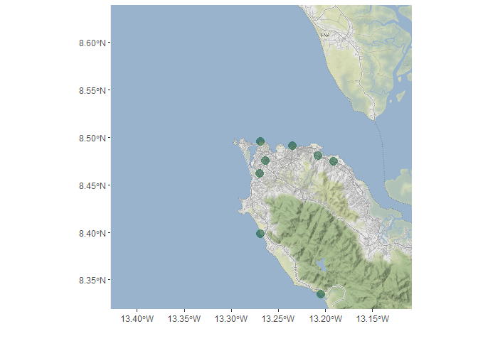

UrbanShift - OSM data
================
Saif Shabou
28 July 2021

# OpenStreetMap (OSM) data

OSM is a global open access mapping project, which is free and under the
[ODbLlicense](https://www.openstreetmap.org/copyright). See the [OSM
wiki](https://wiki.openstreetmap.org/wiki/Contribute_map_data) to find
out how to contribute to the world’s open geographical data commons.

# The Overpass API

The [oevrpass API](https://www.overpass-api.de/) is a read-only API that
serves up custom selected parts of the OSM map data.

# Extratc OSM data

``` r
library(tidyverse)
library(osmdata)
library(sf)
library(ggmap)

# get amenity data

q <- getbb("Freetown") %>%
  opq() %>%
  add_osm_feature(key = "amenity", value = c("bus_station","parking","parking_space")) 

amenity_data <- osmdata_sf(q)

amenity_data_points = amenity_data$osm_points

amenity_data_points = amenity_data_points %>% 
  drop_na(amenity) %>% 
  select(osm_id,
         feature_name = name,
         feature_type = amenity) %>% 
  add_column(feature_category = "amenity")

# query building data


q <- getbb("Freetown") %>%
  opq() %>%
  add_osm_feature(key = "building", value = c("hotel","residential","transportation"))

building_data <- osmdata_sf(q)

building_data_points = building_data$osm_points

building_data_points = building_data_points %>% 
  drop_na(building) %>% 
  select(osm_id,
         feature_name = name,
         feature_type = building) %>% 
  add_column(feature_category = "building")

# merge all types

feature_data_points = amenity_data_points %>% 
  bind_rows(building_data_points)

# plot

#our background map
mad_map <- get_map(getbb("Freetown"), maptype = "toner-background")

#final map
ggmap(mad_map)+
  geom_sf(data = feature_data_points,
          inherit.aes = FALSE,
          colour = "#238443",
          fill = "#004529",
          alpha = .5,
          size = 4,
          shape = 21)+
  labs(x = "", y = "")
```

<!-- -->

``` r
# write

st_write(feature_data_points,
         "data/freetown/osm-amenity-freetown.geojson")
```

    ## Writing layer `osm-amenity-freetown' to data source 
    ##   `data/freetown/osm-amenity-freetown.geojson' using driver `GeoJSON'
    ## Writing 8 features with 4 fields and geometry type Point.
